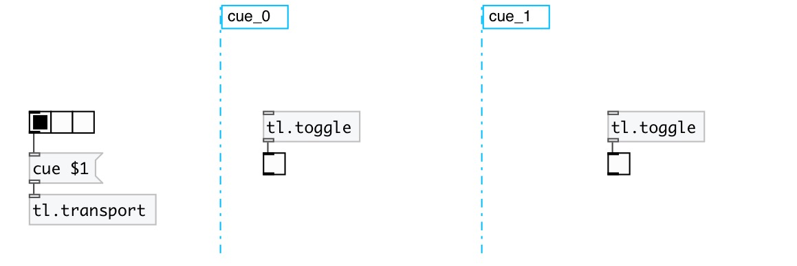
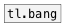
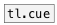

[< reference home](index.html)
---

# tl.toggle

Timeline bang

---

Output 1 when cue section activated, 0 when switched to other cue section
 

---

---
arguments:

---
properties:

@cue: related cue 

---
see also: 

