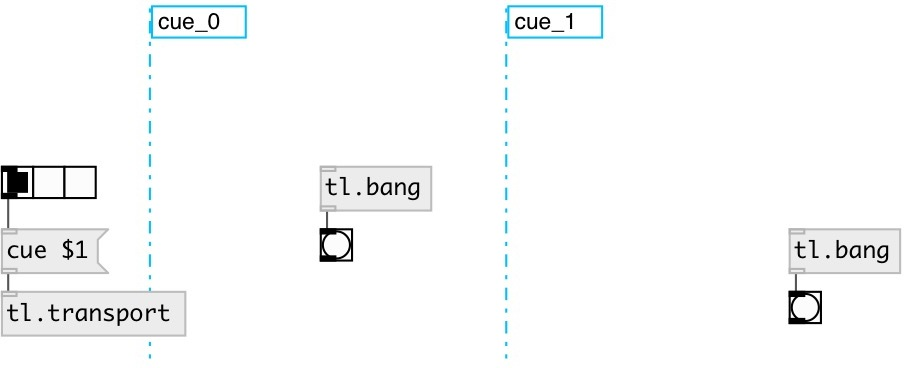

[index](index.html) :: [tl](category_tl.html)
---

# tl.transport

###### Timeline transport control

*available since version:* 0.1

---

## methods:

* **cue**
sets cue index 
  __parameters:__
  - **[N]** cue index 
    type: int  

## inlets:

* control input 
_type:_ control

## keywords:

[timeline](keywords/timeline.html)
[transport](keywords/transport.html)

**See also:**
[\[tl.cue\]](tl.cue.html)

**Authors:** Alex Nadzharov, Serge Poltavsky

**License:** GPL3 or later

