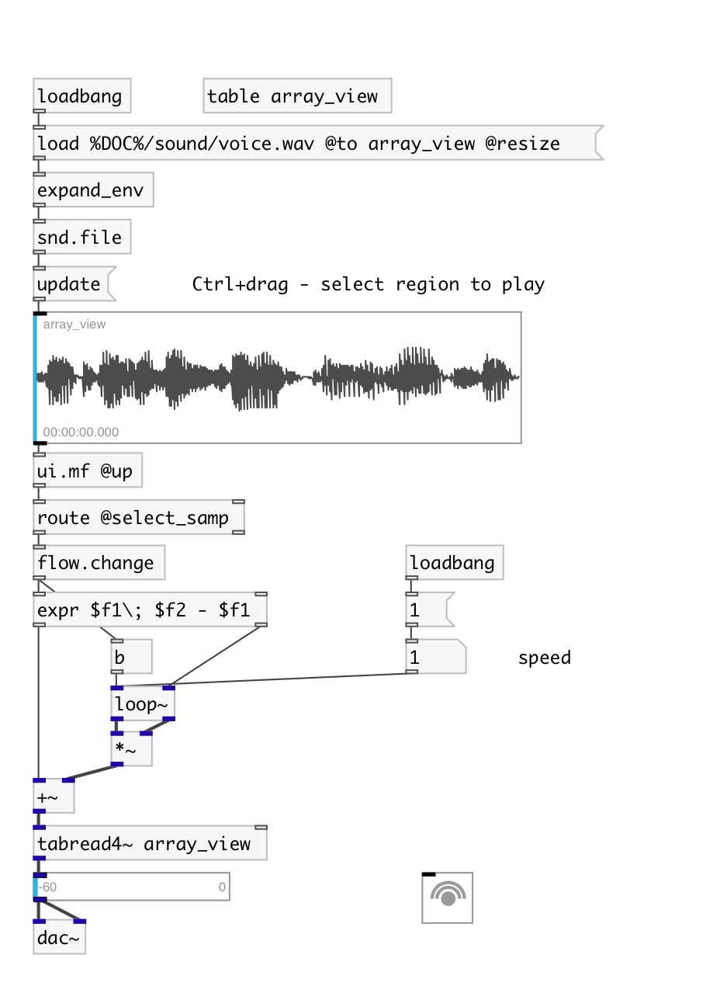

[< reference home](index.html)
---

# ui.aview

array view with cursor and selection

---

 

---

---
arguments:

---
properties:

@array: array name 
@mouse_events: mouse events output
            mode. If on outputs @mouse_down, @mouse_up and @mouse_drag events 
@cursor_samp(samp): cursor position in
            samples 
@cursor_phase: 
            cursor position in 0-1 range 
@cursor_sec(sec): cursor position in
            seconds 
@cursor_ms(ms): cursor
            position in milliseconds 
@select_samp(samp): selection range in samples,
            pair of values: begin, end 
@select_sec(sec): selection range in seconds,
            pair of values: begin, end 
@select_ms(ms): selection range in
            milliseconds, pair of values: begin, end 
@select_phase: selection range noramlized to 0-1 range,
            pair of values: begin, end 
@show_rms: show RMS graph 
@show_labels: if show corner
            labels 
@label_top: top right label if @show_labels is
            on 
@label_bottom: bottom right label if @show_labels is
            on 
@size_samp(samp): array size in samples 
@size_sec(sec): array size in seconds 
@size_ms(ms): array size in milliseconds 
@send: send destination 
@receive: receive source 
@size: element size (width, height
            pair) 
@pinned: pin mode. if 1 - put element
            to the lowest level 
@selection_color: selection color
            (list of red, green, blue values in 0-1 range) 
@cursor_color: cursor color (list of
            red, green, blue values in 0-1 range) 
@wave_color: wave color (list of
            red, green, blue values in 0-1 range) 
@background_color: element
            background color (list of red, green, blue values in 0-1 range) 
@border_color: border color (list
            of red, green, blue values in 0-1 range) 
@fontsize: 
            fontsize 
@fontname: fontname 
@fontweight: font
            weight 
@fontslant: font
            slant 

