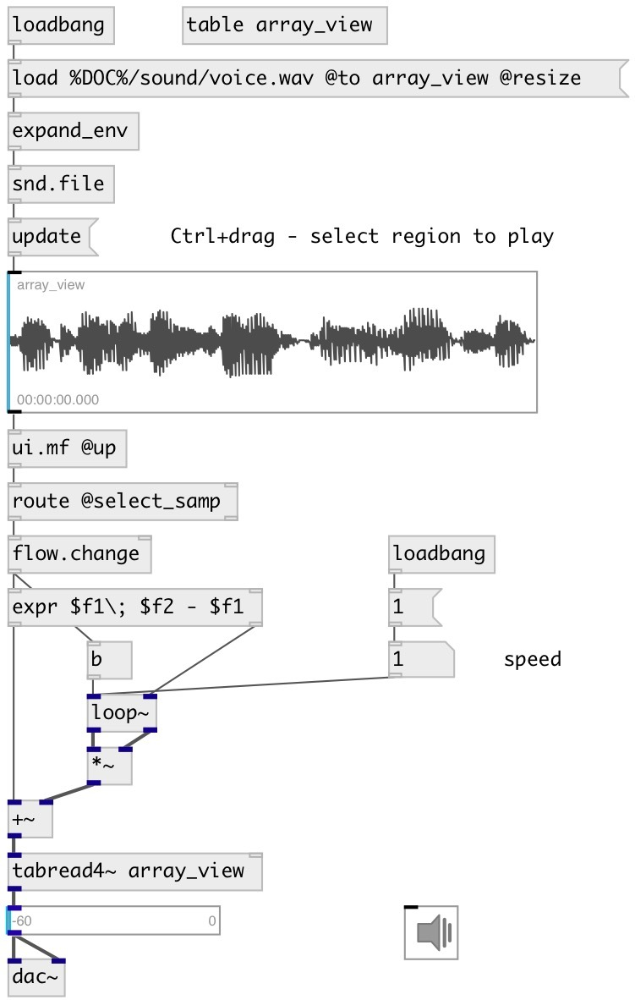

[index](index.html) :: [ui](category_ui.html)
---

# ui.aview

###### array view with cursor and selection

*available since version:* 0.6

---

## methods:

* **update**
redraws view 

* **select**
set selection 
  __parameters:__
  - **BEGIN** selection start in samples 
    type: int  
    required: True  

  - **END** selection end in samples 
    type: int  
    required: True  

* **pos**
set UI element position 
  __parameters:__
  - **X** top left x-coord 
    type: float  
    required: True  

  - **Y** top right y-coord 
    type: float  
    required: True  

* **dump**
dumps all object info to Pd console window. 

## properties:

* **@array** 
Get/set array name 
_type:_ symbol 

* **@mouse_events** 
Get/set mouse events output mode. If on outputs @mouse_down, @mouse_up and @mouse_drag
events 
_type:_ bool 
_default:_ 1 

* **@cursor_samp** 
Get/set cursor position in samples 
_type:_ int 
_units:_ samp 
_default:_ 0 

* **@cursor_phase** 
Get/set cursor position in 0-1 range 
_type:_ float 
_range:_ 0..1 
_default:_ 0 

* **@cursor_sec** 
Get/set cursor position in seconds 
_type:_ float 
_units:_ sec 
_default:_ 0 

* **@cursor_ms** 
Get/set cursor position in milliseconds 
_type:_ float 
_units:_ ms 
_default:_ 0 

* **@select_samp** 
Get/set selection range in samples, pair of values: begin, end 
_type:_ list 
_units:_ samp 

* **@select_sec** 
Get/set selection range in seconds, pair of values: begin, end 
_type:_ list 
_units:_ sec 

* **@select_ms** 
Get/set selection range in milliseconds, pair of values: begin, end 
_type:_ list 
_units:_ ms 

* **@select_phase** 
Get/set selection range noramlized to 0-1 range, pair of values: begin, end 
_type:_ list 

* **@show_rms** 
Get/set show RMS graph 
_type:_ bool 
_default:_ 0 

* **@show_labels** 
Get/set if show corner labels 
_type:_ bool 
_default:_ 0 

* **@label_top** 
Get/set top right label if @show_labels is on 
_type:_ symbol 

* **@label_bottom** 
Get/set bottom right label if @show_labels is on 
_type:_ symbol 

* **@size_samp** (readonly)
Get array size in samples 
_type:_ int 
_units:_ samp 
_min value:_ 0 
_default:_ 0 

* **@size_sec** (readonly)
Get array size in seconds 
_type:_ float 
_units:_ sec 
_min value:_ 0 
_default:_ 0 

* **@size_ms** (readonly)
Get array size in milliseconds 
_type:_ float 
_units:_ ms 
_min value:_ 0 
_default:_ 0 

* **@send** 
Get/set send destination 
_type:_ symbol 
_default:_ (null) 

* **@receive** 
Get/set receive source 
_type:_ symbol 
_default:_ (null) 

* **@size** 
Get/set element size (width, height pair) 
_type:_ list 
_default:_ 300 100 

* **@pinned** 
Get/set pin mode. if 1 - put element to the lowest level 
_type:_ bool 
_default:_ 0 

* **@selection_color** 
Get/set selection color (list of red, green, blue values in 0-1 range) 
_type:_ list 
_default:_ 0 0.75 1 1 

* **@cursor_color** 
Get/set cursor color (list of red, green, blue values in 0-1 range) 
_type:_ list 
_default:_ 0 0.75 1 1 

* **@wave_color** 
Get/set wave color (list of red, green, blue values in 0-1 range) 
_type:_ list 
_default:_ 0.3 0.3 0.3 1 

* **@background_color** 
Get/set element background color (list of red, green, blue values in 0-1 range) 
_type:_ list 
_default:_ 0.93 0.93 0.93 1 

* **@border_color** 
Get/set border color (list of red, green, blue values in 0-1 range) 
_type:_ list 
_default:_ 0.6 0.6 0.6 1 

* **@fontsize** 
Get/set fontsize 
_type:_ int 
_range:_ 4..100 
_default:_ 11 

* **@fontname** 
Get/set fontname 
_type:_ symbol 
_enum:_ Courier, DejaVu, Helvetica, Monaco, Times 
_default:_ Helvetica 

* **@fontweight** 
Get/set font weight 
_type:_ symbol 
_enum:_ normal, bold 
_default:_ normal 

* **@fontslant** 
Get/set font slant 
_type:_ symbol 
_enum:_ roman, italic 
_default:_ roman 

## inlets:

* output current cursor positions: @cursor_samp, @cursor_phase, @cursor_ms, @cursor_sec and selection (if selected): @select_samp, @select_phase, @select_ms, @select_sec, @begin, @end 
_type:_ control

## outlets:

* output 
_type:_ control

## keywords:

[ui](keywords/ui.html)
[array](keywords/array.html)
[view](keywords/view.html)

**Authors:** Serge Poltavsky

**License:** GPL3 or later

