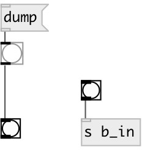

[index](index.html) :: [ui](category_ui.html)
---

# ui.bang
**aliases:** [ui.b]

###### A bang... that&#39;s all

*available since version:* 0.1

---

## information
do nothing more than vanilla bang for the moment...

## methods:

* **dump**
dumps all object info to Pd console window. 

* **pos**
set UI element position 
  __parameters:__
  - **X** top left x-coord 
    type: float  
    required: True  

  - **Y** top right y-coord 
    type: float  
    required: True  

## properties:

* **@send** 
Get/set send destination 
_type:_ symbol 
_default:_ (null) 

* **@receive** 
Get/set receive source 
_type:_ symbol 
_default:_ (null) 

* **@size** 
Get/set element size (width, height pair) 
_type:_ list 
_default:_ 15 15 

* **@pinned** 
Get/set pin mode. if 1 - put element to the lowest level 
_type:_ int 
_enum:_ 0, 1 
_default:_ 0 

* **@active_color** 
Get/set element active color (list of red, green, blue values in 0-1 range) 
_type:_ list 
_default:_ 0 0.75 1 1 

* **@background_color** 
Get/set element background color (list of red, green, blue values in 0-1 range) 
_type:_ list 
_default:_ 0.93 0.93 0.93 1 

* **@border_color** 
Get/set border color (list of red, green, blue values in 0-1 range) 
_type:_ list 
_default:_ 0.6 0.6 0.6 1 

* **@fontsize** 
Get/set fontsize 
_type:_ int 
_range:_ 4..11 
_default:_ 11 

* **@fontname** 
Get/set fontname 
_type:_ symbol 
_default:_ Helvetica 

* **@fontweight** 
Get/set font weight 
_type:_ symbol 
_enum:_ normal, bold 
_default:_ normal 

* **@fontslant** 
Get/set font slant 
_type:_ symbol 
_enum:_ roman, italic 
_default:_ roman 

* **@label** 
Get/set label text 
_type:_ symbol 
_default:_ (null) 

* **@label_color** 
Get/set label color in RGB format within 0-1 range, for example: 0.2 0.4 0.1 
_type:_ list 
_default:_ 0 0 0 1 

* **@label_inner** 
Get/set label position (1 - inner, 0 - outer). 
_type:_ int 
_enum:_ 0, 1 
_default:_ 0 

* **@label_align** 
Get/set label horizontal align 
_type:_ symbol 
_enum:_ left, center, right 
_default:_ left 

* **@label_valign** 
Get/set label vertical align 
_type:_ symbol 
_enum:_ top, center, bottom 
_default:_ top 

* **@label_side** 
Get/set label snap side 
_type:_ symbol 
_enum:_ left, top, right, bottom 
_default:_ top 

* **@label_margins** 
Get/set label offset in pixels 
_type:_ list 
_default:_ 0 0 

## inlets:

* outputs bang 
_type:_ control

## outlets:

* bang output 
_type:_ control

## keywords:

[ui](keywords/ui.html)
[bang](keywords/bang.html)

**See also:**
[\[ui.toggle\]](ui.toggle.html)

**Authors:** Pierre Guillot

**License:** GPL3 or later

