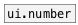

# ui.colorpanel

```


[ui.colorpanel]          [ui.colorpanel @size 193 14]
|                        |
|                        |
|                        [route @rgb]
|                        |
|                        [msg @background_color]
|                        |
|                        [ui.radio]
|
[route @pd]
|
[color $1(
|
[tgl]

            
```
---
arguments:


---
properties:

@matrix: matrix size<br>
@index: color position in panel<br>
@reverse: matrix reversed<br>
@saturation: 
            saturation<br>
@hue: first
            hue<br>
@lightness: first
            lightness<br>
@pd: pd color value<br>
@rgb: RGB value triplet on 0-1
            range<br>
@hsl: HSL value triplet on 0-1
            range<br>
@hex: HEX value in format
            #RRGGBB<br>
@presetname: preset name for using with
            [ui.preset]<br>
@send: send destination<br>
@receive: receive source<br>
@size: element size (width, height
            pair)<br>
@pinned: pin mode. if 1 - put element
            to the lowest level<br>
@background_color: element
            background color (list of red, green, blue values in 0-1 range)<br>
@border_color: border color (list
            of red, green, blue values in 0-1 range)<br>
@fontsize: 
            fontsize<br>
@fontname: fontname<br>
@fontweight: font
            weight<br>
@fontslant: font
            slant<br>

see also:<br>

