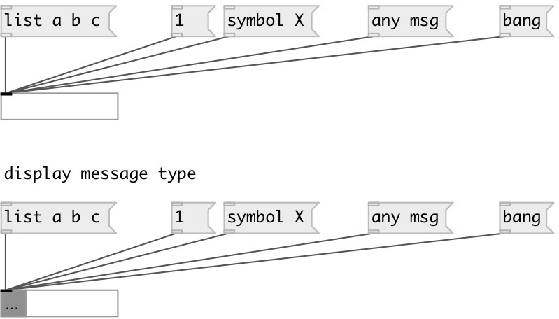

[index](index.html) :: [ui](category_ui.html)
---

# ui.display
**aliases:** [ui.d], [ui.dt]

###### Display GUI object

*available since version:* 0.1

---

## information
[ui.dt] is alias for [ui.display @display_type 1]

## methods:

* **pos**
set UI element position 
  __parameters:__
  - **X** top left x-coord 
    type: float  
    required: True  

  - **Y** top right y-coord 
    type: float  
    required: True  

## properties:

* **@auto_size** 
Get/set flag if automatically resize contents to feet incoming message 
_type:_ int 
_enum:_ 0, 1 
_default:_ 1 

* **@display_type** 
Get/set flag for displaying incoming message type 
_type:_ int 
_enum:_ 0, 1 
_default:_ 0 

* **@display_events** 
Get/set flag for blinking on incoming messages 
_type:_ int 
_enum:_ 0, 1 
_default:_ 1 

* **@float_width** 
Get/set number of digits after floating point. If -1: skip trailing zeroes, if 0 -
output as integers 
_type:_ int 
_range:_ -1..17 
_default:_ -1 

* **@hex_width** 
Get/set hex output format width 
_type:_ int 
_range:_ 0..16 
_default:_ 2 

* **@hex** 
Get/set output integers in hex format 
_type:_ int 
_enum:_ 0, 1 
_default:_ 0 

* **@send** 
Get/set send destination 
_type:_ symbol 
_default:_ (null) 

* **@receive** 
Get/set receive source 
_type:_ symbol 
_default:_ (null) 

* **@size** 
Get/set element size (width, height pair) 
_type:_ list 
_default:_ 80 18 

* **@pinned** 
Get/set pin mode. if 1 - put element to the lowest level 
_type:_ int 
_enum:_ 0, 1 
_default:_ 0 

* **@active_color** 
Get/set element active color (list of red, green, blue values in 0-1 range) 
_type:_ list 
_default:_ 0 0.75 1 1 

* **@text_color** 
Get/set text color (list of red, green, blue values in 0-1 range) 
_type:_ list 
_default:_ 0 0 0 1 

* **@background_color** 
Get/set element background color (list of red, green, blue values in 0-1 range) 
_type:_ list 
_default:_ 0.93 0.93 0.93 1 

* **@border_color** 
Get/set border color (list of red, green, blue values in 0-1 range) 
_type:_ list 
_default:_ 0.6 0.6 0.6 1 

* **@fontsize** 
Get/set fontsize 
_type:_ int 
_range:_ 4..11 
_default:_ 11 

* **@fontname** 
Get/set fontname 
_type:_ symbol 
_default:_ Helvetica 

* **@fontweight** 
Get/set font weight 
_type:_ symbol 
_enum:_ normal, bold 
_default:_ normal 

* **@fontslant** 
Get/set font slant 
_type:_ symbol 
_enum:_ roman, italic 
_default:_ roman 

## inlets:

* accepts any messages and displays it 
_type:_ control

## keywords:

[display](keywords/display.html)

**See also:**
[\[msg\]](msg.html)

**Authors:** Alex Nadzharov, Serge Poltavsky

**License:** GPL3 or later

