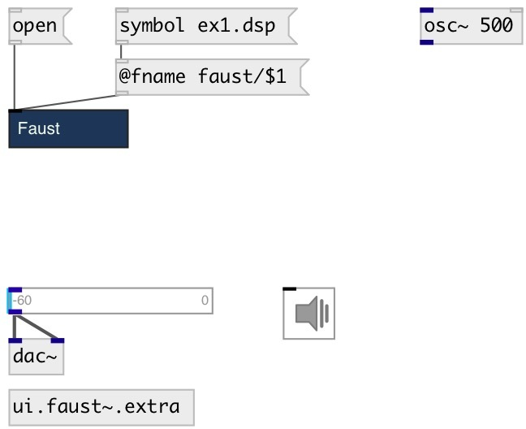

[index](index.html) :: [lang](category_lang.html)
---

# ui.faust~

###### faust compiled ui object

*available since version:* 0.9.2

---

## arguments:

* **FNAME**
path to faust dsp file 
_type:_ symbol 

## methods:

* **open**
open faust dsp file in external editor 

* **reset**
reset object state 

* **update**
update faust object, recompile if needed 

## properties:

* **@fname** 
Get/set path to faust dsp file 
_type:_ symbol 

* **@include** 
Get/set list of faust include directories 
_type:_ list 

* **@auto** 
Get/set auto update mode. If on - recompiles faust dsp file on change 
_type:_ int 
_enum:_ 0, 1 
_default:_ 1 

## inlets:

* control input 
_type:_ control
* first faust input 
_type:_ audio
* ... faust input 
_type:_ audio
* n-th faust input 
_type:_ audio

## outlets:

* first faust output 
_type:_ audio
* ... faust output 
_type:_ audio
* n-th faust output 
_type:_ audio

## keywords:

[faust](keywords/faust.html)

**Authors:** Serge Poltavsky

**License:** GPL3 or later

