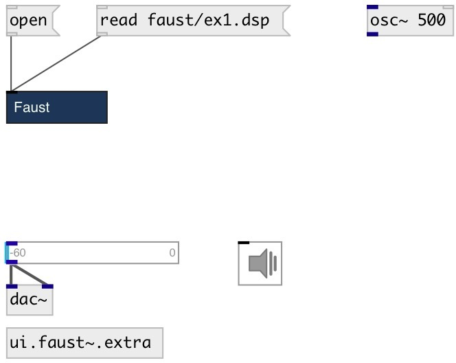

[index](index.html) :: [lang](category_lang.html)
---

# ui.faust~

###### faust compiled ui object

*available since version:* 0.9.2

---

## arguments:

* **LOAD**
initial file to load after object creation 
_type:_ symbol 

## methods:

* **open**
open faust dsp file in external editor 

* **reset**
reset object state 

* **size**
resize object 
  __parameters:__
  - **W** new width 
    type: int  
    required: True  

  - **H** new height 
    type: int  
    required: True  

* **read**
read Faust code from file and compile it. 
  __parameters:__
  - **FILE** file path, absolute or relative to patch, include directories 
    type: symbol  
    required: True  

* **write**
write Faust code to file. 
  __parameters:__
  - **FILE** file path, absolute or relative to patch 
    type: symbol  
    required: True  

  - **[@force]** overwrite existing files 
    type: property  

## properties:

* **@load** (initonly)
Get/set initial file to load after object creation 
_type:_ symbol 

* **@include** 
Get/set list of faust include directories 
_type:_ list 

* **@active** 
Get/set on/off dsp processing 
_type:_ bool 
_default:_ 1 

* **@size** 
Get/set object size 
_type:_ list 
_default:_ 10 10 

* **@style** 
Get/set view style 
_type:_ int 
_default:_ 0 

## inlets:

* control input 
_type:_ control
* first faust input 
_type:_ audio
* ... faust input 
_type:_ audio
* n-th faust input 
_type:_ audio

## outlets:

* first faust output 
_type:_ audio
* ... faust output 
_type:_ audio
* n-th faust output 
_type:_ audio

## keywords:

[faust](keywords/faust.html)

**Authors:** Serge Poltavsky

**License:** GPL3 or later

