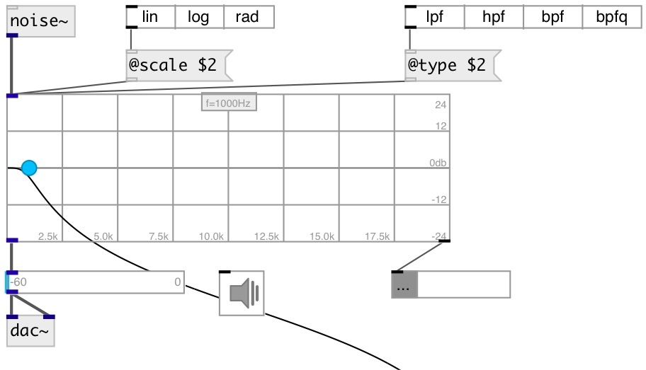

[index](index.html) :: [ui](category_ui.html)
---

# ui.filter~

###### UI filter object based on biquad filter

*available since version:* 0.9.3

---

## methods:

* **biquad**
set biquad coefficients (but not changes current filter properties) 
  __parameters:__
  - **b0 b1 b2 a1 a2** coefficients 
    type: list  
    required: True  

* **dump**
dumps all object info to Pd console window 

* **load**
loads specified preset 
  __parameters:__
  - **IDX** preset index 
    type: int  
    required: True  

* **store**
stores specified preset 
  __parameters:__
  - **IDX** preset index 
    type: int  
    required: True  

* **clear**
clears specified preset 
  __parameters:__
  - **IDX** preset index 
    type: int  
    required: True  

* **interp**
for this object acts as *load*, no interpolation performed 

* **pos**
set UI element position 
  __parameters:__
  - **X** top left x-coord 
    type: float  
    required: True  

  - **Y** top right y-coord 
    type: float  
    required: True  

## properties:

* **@freq** 
Get/set filter frequency 
_type:_ float 
_range:_ 0..20000 
_default:_ 1000 

* **@scale** 
Get/set frequency scale 
_type:_ symbol 
_enum:_ lin, log, rad 
_default:_ lin 

* **@type** 
Get/set frequency scale 
_type:_ symbol 
_enum:_ lpf, hpf, bpf, bpfq, lowshelf, highshelf, peak, notch 
_default:_ lpf 

* **@gain** 
Get/set gain (for low/highshelf/peak filters) 
_type:_ float 
_units:_ db 
_range:_ -24..24 
_default:_ 0 

* **@q** 
Get/set quality factor 
_type:_ float 
_range:_ 0.0156..64 
_default:_ 0.7071 

* **@presetname** 
Get/set preset name for using with [ui.preset] 
_type:_ symbol 
_default:_ (null) 

* **@send** 
Get/set send destination 
_type:_ symbol 
_default:_ (null) 

* **@receive** 
Get/set receive source 
_type:_ symbol 
_default:_ (null) 

* **@size** 
Get/set element size (width, height pair) 
_type:_ list 
_default:_ 300 100 

* **@pinned** 
Get/set pin mode. if 1 - put element to the lowest level 
_type:_ bool 
_default:_ 0 

* **@mouse_events** 
Get/set mouse events output mode. If on outputs @mouse_down, @mouse_up and @mouse_drag
events 
_type:_ bool 
_default:_ 0 

* **@background_color** 
Get/set element background color (list of red, green, blue values in 0-1 range) 
_type:_ list 
_default:_ 0.93 0.93 0.93 1 

* **@border_color** 
Get/set border color (list of red, green, blue values in 0-1 range) 
_type:_ list 
_default:_ 0.6 0.6 0.6 1 

* **@knob_color** 
Get/set knob color 
_type:_ list 
_default:_ 0 0.75 1 1 

* **@grid_color** 
Get/set knob color 
_type:_ list 
_default:_ 0.6 0.6 0.6 1 

* **@plot_color** 
Get/set knob color 
_type:_ list 
_default:_ 0 0 0 1 

* **@fontsize** 
Get/set fontsize 
_type:_ int 
_range:_ 4..100 
_default:_ 11 

* **@fontname** 
Get/set fontname 
_type:_ symbol 
_enum:_ Courier, DejaVu, Helvetica, Monaco, Times 
_default:_ Helvetica 

* **@fontweight** 
Get/set font weight 
_type:_ symbol 
_enum:_ normal, bold 
_default:_ normal 

* **@fontslant** 
Get/set font slant 
_type:_ symbol 
_enum:_ roman, italic 
_default:_ roman 

* **@label** 
Get/set label text 
_type:_ symbol 
_default:_ (null) 

* **@label_color** 
Get/set label color in RGB format within 0-1 range, for example: 0.2 0.4 0.1 
_type:_ list 
_default:_ 0.6 0.6 0.6 1 

* **@label_align** 
Get/set label horizontal align 
_type:_ symbol 
_enum:_ left, center, right 
_default:_ left 

* **@label_valign** 
Get/set label vertical align 
_type:_ symbol 
_enum:_ top, center, bottom 
_default:_ top 

* **@label_side** 
Get/set label snap side 
_type:_ symbol 
_enum:_ left, top, right, bottom 
_default:_ top 

* **@label_margins** 
Get/set label offset in pixels 
_type:_ list 
_default:_ 0 0 

## inlets:

* input signal 
_type:_ audio

## outlets:

* filtered signal 
_type:_ audio
* list: filter biquad coefficient 
_type:_ control

## keywords:

[ui](keywords/ui.html)
[filter](keywords/filter.html)
[biquad](keywords/biquad.html)

**See also:**
[\[ui.filter\]](ui.filter.html)

**Authors:** Serge Poltavsky

**License:** GPL3 or later

