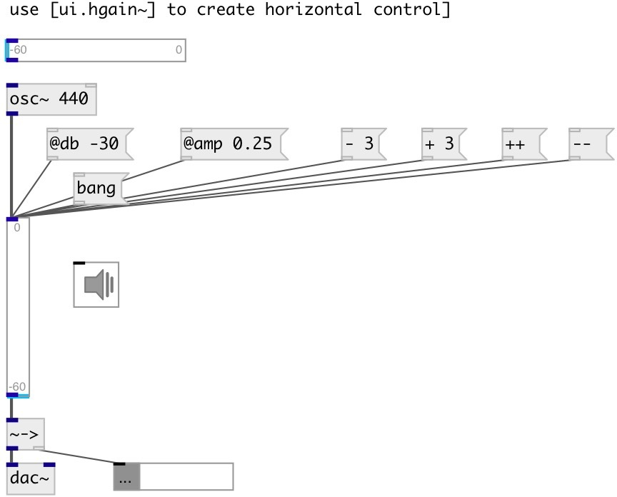

[index](index.html) :: [ui](category_ui.html)
---

# ui.gain~

###### UI gain control

*available since version:* 0.5

---

## methods:

* **+ N**
increase current gain by N db 

* **- N**
decrease current gain by N db 

* **++**
decrease current gain by 1 db 

* **--**
decrease current gain by 1 db 

* **set N**
set current gain to N db 

* **load**
loads specified preset 
  __parameters:__
  - **IDX** preset index 
    type: int  
    required: True  

* **store**
stores specified preset 
  __parameters:__
  - **IDX** preset index 
    type: int  
    required: True  

* **clear**
clears specified preset 
  __parameters:__
  - **IDX** preset index 
    type: int  
    required: True  

* **interp**
interplolates between presets 
  __parameters:__
  - **IDX** preset fraction index 
    type: float  
    required: True  

* **pos**
set UI element position 
  __parameters:__
  - **X** top left x-coord 
    type: float  
    required: True  

  - **Y** top right y-coord 
    type: float  
    required: True  

## properties:

* **@max** 
Get/set maximum gain value 
__type:__ int 
__units:__ db 
__range:__ -12..12 
__default:__ 0 

* **@min** 
Get/set minimal gain value 
__type:__ int 
__units:__ db 
__range:__ -90..-15 
__default:__ -60 

* **@db** 
Get/set gain in dbfs scale 
__type:__ float 
__units:__ db 
__default:__ -60 

* **@amp** 
Get/set gain as amplitude ratio 
__type:__ float 
__default:__ 0 

* **@output_value** 
Get/set flag to output @db property after each knob move 
__type:__ int 
__enum:__ 0, 1 
__default:__ 0 

* **@relative** 
Get/set relative input mode. When set do not jump to value on click 
__type:__ int 
__enum:__ 0, 1 
__default:__ 1 

* **@presetname** 
Get/set preset name for using with [ui.preset] 
__type:__ symbol 
__default:__ (null) 

* **@show_range** 
Get/set if show slider range 
__type:__ int 
__enum:__ 0, 1 
__default:__ 1 

* **@mouse_events** 
Get/set mouse events output mode. If on outputs @mouse_down, @mouse_up and @mouse_drag
events 
__type:__ int 
__enum:__ 0, 1 
__default:__ 0 

* **@send** 
Get/set send destination 
__type:__ symbol 
__default:__ (null) 

* **@receive** 
Get/set receive source 
__type:__ symbol 
__default:__ (null) 

* **@size** 
Get/set element size (width, height pair) 
__type:__ list 
__default:__ 15 120 

* **@pinned** 
Get/set pin mode. if 1 - put element to the lowest level 
__type:__ int 
__enum:__ 0, 1 
__default:__ 0 

* **@knob_color** 
Get/set knob color (list of red, green, blue values in 0-1 range) 
__type:__ list 
__default:__ 0 0.75 1 1 

* **@background_color** 
Get/set element background color (list of red, green, blue values in 0-1 range) 
__type:__ list 
__default:__ 0.93 0.93 0.93 1 

* **@border_color** 
Get/set border color (list of red, green, blue values in 0-1 range) 
__type:__ list 
__default:__ 0.6 0.6 0.6 1 

* **@fontsize** 
Get/set fontsize 
__type:__ int 
__range:__ 4..11 
__default:__ 11 

* **@fontname** 
Get/set fontname 
__type:__ symbol 
__default:__ Helvetica 

* **@fontweight** 
Get/set font weight 
__type:__ symbol 
__enum:__ normal, bold 
__default:__ normal 

* **@fontslant** 
Get/set font slant 
__type:__ symbol 
__enum:__ roman, italic 
__default:__ roman 

* **@midi_channel** 
Get/set binded MIDI channel. 0 means listen to all channels 
__type:__ int 
__range:__ 0..16 
__default:__ 0 

* **@midi_control** 
Get/set binded MIDI controller number. 0 means not binded to any controller. 
__type:__ int 
__range:__ 0..128 
__default:__ 0 

* **@midi_pickup** 
Get/set pickup current value. If slider is binded to value, first time you should pass
over this value to make binding. It prevents from sudden value change on first
control change 
__type:__ int 
__enum:__ 0, 1 
__default:__ 1 

## inlets:

* input signal 
__type:__ audio 

## outlets:

* output signal
__type:__ audio 

## keywords:

[ui](keywords/ui.html)
[gain](keywords/gain.html)

**Authors:** Serge Potlavsky

**License:** GPL3 or later

