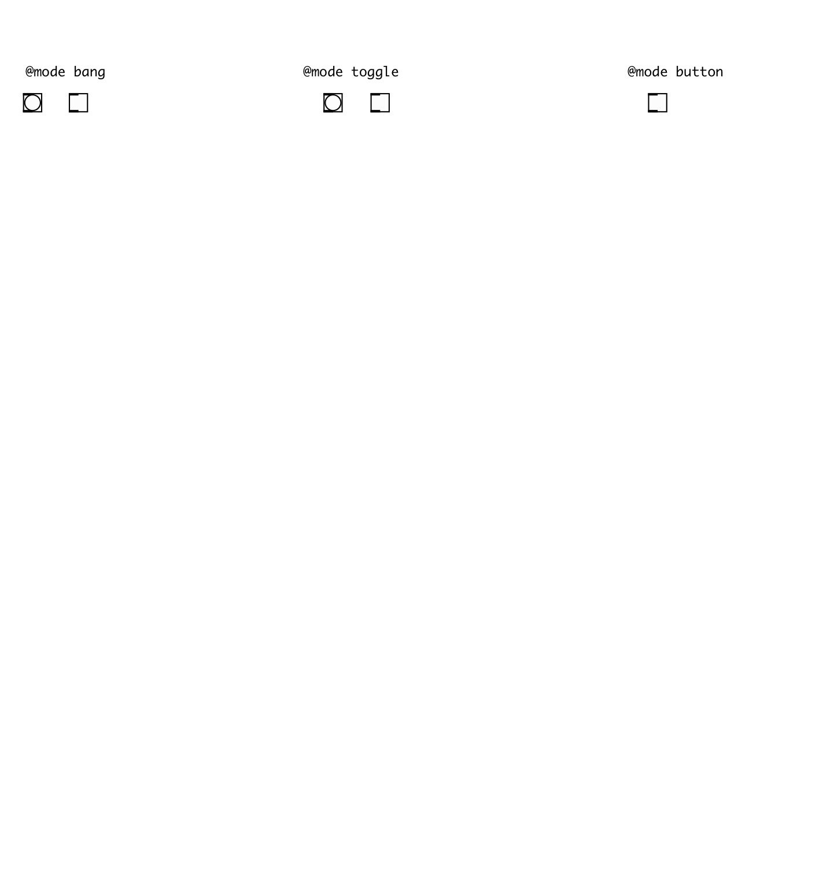

[< reference home](index.html)
---

# ui.icon

simple icon with button capabilities

---

Alt+Click outputs all possible icon names to Pd window. Can be in bang, button and
            toggle modes. Button mode is default: outputs 1 on mouse down, 0 on mouse up. See @mode
            property for more information.
 

---

---
arguments:

NAME: icon name from list 

---
properties:

@mode: output
            mode. In bang mode - outputs bang on mouse down. In button mode outputs 1 on mouse down
            and 0 on mouse up. In toggle mode outputs 1/0 on mouse down, like vanilla toggle
            object. 
@enabled: enabled property 
@icon_size: icons
            size 
@icon: 
            icon name 
@presetname: preset name for using with
            [ui.preset] 
@send: send destination 
@receive: receive source 
@size: element size (width, height
            pair) 
@pinned: pin mode. if 1 - put element
            to the lowest level 
@active_color: active color (list of
            red, green, blue values in 0-1 range) 
@background_color: element background
            color (list of red, green, blue values in 0-1 range) 
@border_color: border color (list of red,
            green, blue values in 0-1 range) 
@fontsize: 
            fontsize 
@fontname: fontname 
@fontweight: font
            weight 
@fontslant: font
            slant 

---
see also: 

