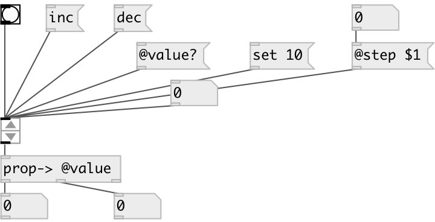

[index](index.html) :: [ui](category_ui.html)
---

# ui.incdec

###### value increment/decrement

*available since version:* 0.1

---

## methods:

* **set**
set widget value with no output 
  __parameters:__
  - **VAL** value 
    type: float  
    required: True  

* **inc**
increments widget with output 

* **dec**
decrements widget with output 

* **load**
loads specified preset 
  __parameters:__
  - **IDX** preset index 
    type: int  
    required: True  

* **store**
stores specified preset 
  __parameters:__
  - **IDX** preset index 
    type: int  
    required: True  

* **clear**
clears specified preset 
  __parameters:__
  - **IDX** preset index 
    type: int  
    required: True  

* **interp**
for this object acts as *load*, no interpolation performed 

* **pos**
set UI element position 
  __parameters:__
  - **X** top left x-coord 
    type: float  
    required: True  

  - **Y** top right y-coord 
    type: float  
    required: True  

## properties:

* **@step** 
Get/set increment step 
__type:__ float 
__min value:__ 0 
__default:__ 1 

* **@value** 
Get/set current widget value 
__type:__ float 
__default:__ 0 

* **@presetname** 
Get/set preset name for using with [ui.preset] 
__type:__ symbol 
__default:__ (null) 

* **@send** 
Get/set send destination 
__type:__ symbol 
__default:__ (null) 

* **@receive** 
Get/set receive source 
__type:__ symbol 
__default:__ (null) 

* **@size** 
Get/set element size (width, height pair) 
__type:__ list 
__default:__ 15 20 

* **@pinned** 
Get/set pin mode. if 1 - put element to the lowest level 
__type:__ int 
__enum:__ 0, 1 
__default:__ 0 

* **@arrow_color** 
Get/set arrow color (list of red, green, blue values in 0-1 range) 
__type:__ list 
__default:__ 0.6 0.6 0.6 1 

* **@background_color** 
Get/set element background color (list of red, green, blue values in 0-1 range) 
__type:__ list 
__default:__ 0.93 0.93 0.93 1 

* **@border_color** 
Get/set border color (list of red, green, blue values in 0-1 range) 
__type:__ list 
__default:__ 0.6 0.6 0.6 1 

* **@fontsize** 
Get/set fontsize 
__type:__ int 
__range:__ 4..11 
__default:__ 11 

* **@fontname** 
Get/set fontname 
__type:__ symbol 
__default:__ Helvetica 

* **@fontweight** 
Get/set font weight 
__type:__ symbol 
__enum:__ normal, bold 
__default:__ normal 

* **@fontslant** 
Get/set font slant 
__type:__ symbol 
__enum:__ roman, italic 
__default:__ roman 

## inlets:

* outputs current widget value 
__type:__ control 

## outlets:

* output value
__type:__ control 

## keywords:

[ui](keywords/ui.html)
[increment](keywords/increment.html)
[decrement](keywords/decrement.html)

**See also:**
[\[ui.number\]](ui.number.html)

**Authors:** Pierre Guillot

**License:** GPL3 or later

