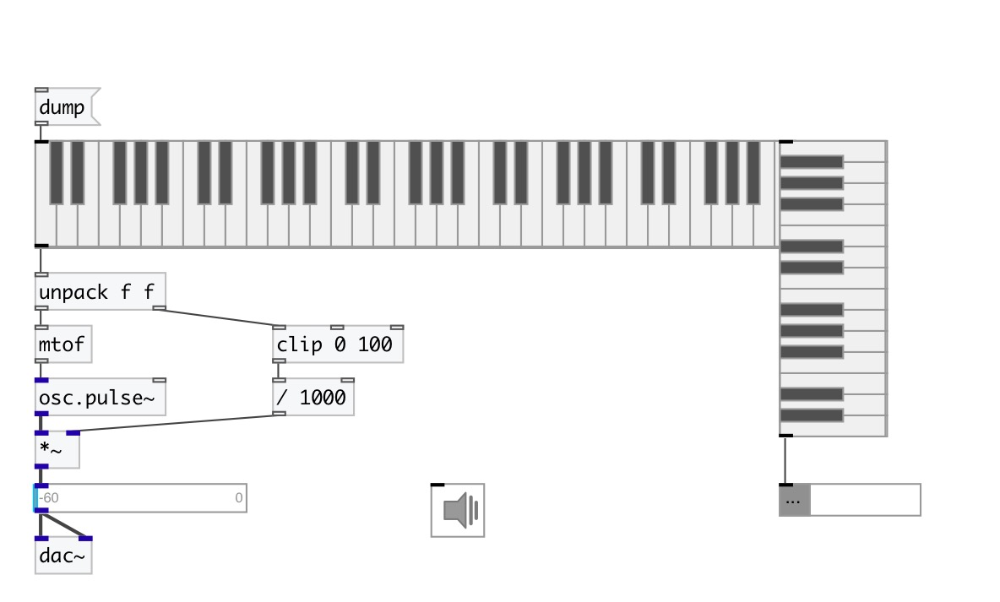

[index](index.html) :: [ui](category_ui.html)
---

# ui.keyboard
**aliases:** [ui.hk], [ui.vkeyboard], [ui.vk]

###### keyboard widget

*available since version:* 0.1

---

## information
Piano keyboard widget [ui.vkeyboard] and [ui.vk] - aliases for vertical keyboard

## arguments:

* **NKEYS**
number of keys 
_type:_ int 

* **SHIFT**
pitch of starting key 
_type:_ int 

## methods:

* **dump**
dumps all object info to Pd console window 

* **pos**
set UI element position 
  __parameters:__
  - **X** top left x-coord 
    type: float  
    required: True  

  - **Y** top right y-coord 
    type: float  
    required: True  

## properties:

* **@keys** 
Get/set number of keys 
_type:_ int 
_range:_ 5..88 
_default:_ 61 

* **@shift** 
Get/set MIDI pitch of starting key 
_type:_ int 
_range:_ 6..88 
_default:_ 36 

* **@send** 
Get/set send destination 
_type:_ symbol 
_default:_ (null) 

* **@receive** 
Get/set receive source 
_type:_ symbol 
_default:_ (null) 

* **@size** 
Get/set element size (width, height pair) 
_type:_ list 
_default:_ 433 60 

* **@pinned** 
Get/set pin mode. if 1 - put element to the lowest level 
_type:_ int 
_enum:_ 0, 1 
_default:_ 0 

* **@active_color** 
Get/set active color (list of red, green, blue values in 0-1 range) 
_type:_ list 
_default:_ 0 0.75 1 1 

* **@background_color** 
Get/set element background color (list of red, green, blue values in 0-1 range) 
_type:_ list 
_default:_ 0.93 0.93 0.93 1 

* **@border_color** 
Get/set border color (list of red, green, blue values in 0-1 range) 
_type:_ list 
_default:_ 0.6 0.6 0.6 1 

* **@fontsize** 
Get/set fontsize 
_type:_ int 
_range:_ 4..11 
_default:_ 11 

* **@fontname** 
Get/set fontname 
_type:_ symbol 
_default:_ Helvetica 

* **@fontweight** 
Get/set font weight 
_type:_ symbol 
_enum:_ normal, bold 
_default:_ normal 

* **@fontslant** 
Get/set font slant 
_type:_ symbol 
_enum:_ roman, italic 
_default:_ roman 

## inlets:

* control inlet 
_type:_ control

## outlets:

* list from two elements: MIDI pitch, MIDI velocity. Velocity depends from key press position. 
_type:_ control

## keywords:

[ui](keywords/ui.html)
[keyboard](keywords/keyboard.html)

**See also:**
[\[ui.preset\]](ui.preset.html)

**Authors:** Alex Nadzharov, Serge Poltavsky

**License:** GPL3 or later

