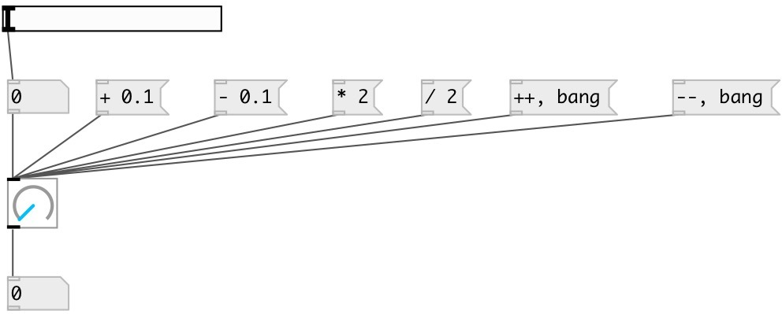

[index](index.html) :: [ui](category_ui.html)
---

# ui.knob

###### knob widget

*available since version:* 0.1

---

## information
Simple knob widget with default range 0-1.

## arguments:

* **min**
min value 
__type:__ float 

* **max**
max value 
__type:__ float 

## methods:

* **set**
sets knob value without output 
  __parameters:__
  - **V** new float value or &#39;random&#39; 
    type: atom  
    required: True  

* **++**
increment knob value without output 

* **--**
decrement knob value without output 

* **+**
add value to knob without output 
  __parameters:__
  - **V** added value 
    type: float  
    required: True  

* **-**
subtract value from knob without output 
  __parameters:__
  - **V** subtracted value 
    type: float  
    required: True  

* *****
multiply knob value without output 
  __parameters:__
  - **V** multiplied value 
    type: float  
    required: True  

* **/**
divide knob value without output 
  __parameters:__
  - **V** denominator value 
    type: float  
    required: True  

* **random**
set knob to random value and output 

* **load**
loads specified preset 
  __parameters:__
  - **IDX** preset index 
    type: int  
    required: True  

* **store**
stores specified preset 
  __parameters:__
  - **IDX** preset index 
    type: int  
    required: True  

* **clear**
clears specified preset 
  __parameters:__
  - **IDX** preset index 
    type: int  
    required: True  

* **interp**
interplolates between presets 
  __parameters:__
  - **IDX** preset fraction index 
    type: float  
    required: True  

* **pos**
set UI element position 
  __parameters:__
  - **X** top left x-coord 
    type: float  
    required: True  

  - **Y** top right y-coord 
    type: float  
    required: True  

* **dump**
dumps all object info to Pd console window 

## properties:

* **@min** 
Get/set minimum knob value 
__type:__ float 
__default:__ 0 

* **@max** 
Get/set maximum knob value 
__type:__ float 
__default:__ 1 

* **@midi_channel** 
Get/set binded MIDI channel. 0 means listen to all channels 
__type:__ int 
__range:__ 0..16 
__default:__ 0 

* **@midi_control** 
Get/set binded MIDI controller number. 0 means not binded to any controller. 
__type:__ int 
__range:__ 0..128 
__default:__ 0 

* **@midi_pickup** 
Get/set pickup current value. If slider is binded to value, first time you should pass
over this value to make binding. It prevents from sudden value change on first
control change 
__type:__ int 
__enum:__ 0, 1 
__default:__ 1 

* **@active_scale** 
Get/set if should draw active scale 
__type:__ int 
__enum:__ 0, 1 
__default:__ 0 

* **@value** 
Get/set current value 
__type:__ float 
__default:__ 0 

* **@show_range** 
Get/set show knob range 
__type:__ int 
__enum:__ 0, 1 
__default:__ 0 

* **@show_value** 
Get/set show value 
__type:__ int 
__enum:__ 0, 1 
__default:__ 0 

* **@scale** 
Get/set scale mode. Linear or logarithmic. 
__type:__ symbol 
__enum:__ linear, log 
__default:__ linear 

* **@presetname** 
Get/set preset name for using with [ui.preset] 
__type:__ symbol 
__default:__ (null) 

* **@send** 
Get/set send destination 
__type:__ symbol 
__default:__ (null) 

* **@receive** 
Get/set receive source 
__type:__ symbol 
__default:__ (null) 

* **@size** 
Get/set element size (width, height pair) 
__type:__ list 
__default:__ 40 40 

* **@pinned** 
Get/set pin mode. if 1 - put element to the lowest level 
__type:__ int 
__enum:__ 0, 1 
__default:__ 0 

* **@mouse_events** 
Get/set mouse events output mode. If on outputs @mouse_down, @mouse_up and @mouse_drag
events 
__type:__ int 
__enum:__ 0, 1 
__default:__ 0 

* **@knob_color** 
Get/set knob color (list of red, green, blue values in 0-1 range) 
__type:__ list 
__default:__ 0 0.75 1 1 

* **@scale_color** 
Get/set scale color (list of red, green, blue values in 0-1 range) 
__type:__ list 
__default:__ 0.6 0.6 0.6 1 

* **@background_color** 
Get/set element background color (list of red, green, blue values in 0-1 range) 
__type:__ list 
__default:__ 0.93 0.93 0.93 1 

* **@border_color** 
Get/set border color (list of red, green, blue values in 0-1 range) 
__type:__ list 
__default:__ 0.6 0.6 0.6 1 

* **@fontsize** 
Get/set fontsize 
__type:__ int 
__range:__ 4..11 
__default:__ 11 

* **@fontname** 
Get/set fontname 
__type:__ symbol 
__default:__ Helvetica 

* **@fontweight** 
Get/set font weight 
__type:__ symbol 
__enum:__ normal, bold 
__default:__ normal 

* **@fontslant** 
Get/set font slant 
__type:__ symbol 
__enum:__ roman, italic 
__default:__ roman 

* **@label** 
Get/set label text 
__type:__ symbol 
__default:__ (null) 

* **@label_color** 
Get/set label color in RGB format within 0-1 range, for example: 0.2 0.4 0.1 
__type:__ list 
__default:__ 0 0 0 1 

* **@label_inner** 
Get/set label position (1 - inner, 0 - outer). 
__type:__ int 
__enum:__ 0, 1 
__default:__ 0 

* **@label_align** 
Get/set label horizontal align 
__type:__ symbol 
__enum:__ left, center, right 
__default:__ left 

* **@label_valign** 
Get/set label vertical align 
__type:__ symbol 
__enum:__ top, center, bottom 
__default:__ top 

* **@label_side** 
Get/set label snap side 
__type:__ symbol 
__enum:__ left, top, right, bottom 
__default:__ top 

* **@label_margins** 
Get/set label offset in pixels 
__type:__ list 
__default:__ 0 0 

## inlets:

* outputs knob value 
__type:__ control 

## outlets:

* knob output
__type:__ control 

## keywords:

[ui](keywords/ui.html)
[knob](keywords/knob.html)

**See also:**
[\[ui.slider\]](ui.slider.html)

**Authors:** Alex Nadzharov, Serge Poltavsky

**License:** GPL3 or later

