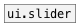

[< reference home](ceammc_lib.html)
---

# ui.knob


knob widget

---

Simple knob widget with default range 0-1.
<br>


---


```


[hsl min=0 max=10]
|
|
[F]   [+ 0.1( [- 0.1( [* 2( [/ 2( [++, bang( [--, bang(
|     |       |       |     |     |          |
|     |       |       |     |     |          |
|     |       |       |     |     |          |
[ui.knob @size 30 30 @max 10                 ]
|
|
|
[F]

            
```

---
arguments:


---
properties:

@min: minimum knob value<br>
@max: maximum knob value<br>
@midi_channel: binded
            MIDI channel. 0 means listen to all channels<br>
@midi_control: 
            binded MIDI controller number. 0 means not binded to any controller.<br>
@midi_pickup: pickup current value.
            If slider is binded to value, first time you should pass over this value to make
            binding. It prevents from sudden value change on first control change<br>
@active_scale: if should draw active
            scale<br>
@value: current value<br>
@show_range: show knob
            range<br>
@scale: scale mode.
            Linear or logarithmic.<br>
@presetname: preset
            name for using with [ui.preset]<br>
@send: send
            destination<br>
@receive: receive
            source<br>
@size: element size
            (width, height pair)<br>
@pinned: pin mode.
            if 1 - put element to the lowest level<br>
@mouse_events: mouse events output
            mode. If on outputs @mouse_down, @mouse_up and @mouse_drag events<br>
@knob_color: knob
            color (list of red, green, blue values in 0-1 range)<br>
@scale_color: 
            scale color (list of red, green, blue values in 0-1 range)<br>
@background_color: element background color (list of red, green, blue values in
            0-1 range)<br>
@border_color: 
            border color (list of red, green, blue values in 0-1 range)<br>
@fontsize: 
            fontsize<br>
@fontname: fontname<br>
@fontweight: font
            weight<br>
@fontslant: font
            slant<br>
@label: label text<br>
@label_color: label color in RGB format
            within 0-1 range, for example: 0.2 0.4 0.1<br>
@label_inner: label position (1 -
            inner, 0 - outer).<br>
@label_align: 
            label horizontal align<br>
@label_valign: 
            label vertical align<br>
@label_side: 
            label snap side<br>
@label_margins: label offset in
            pixels<br>

---
see also:<br>
[](ui.slider.html)
