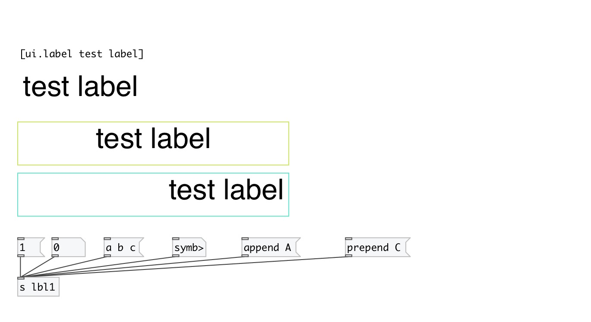

[< reference home](index.html)
---

# ui.label

simple label widget

---

With spaces, text-align, font customization and word wrap
 

---

---
arguments:

---
properties:

@text: label text 
@align: text
            align 
@margin_top: text top margin 
@margin_left: text left margin 
@margin_right: text right margin 
@margin_bottom: text bottom margin 
@send: send destination 
@receive: receive source 
@size: element size (width, height
            pair) 
@pinned: pin mode. if 1 - put element
            to the lowest level 
@text_color: text color (list of red,
            green, blue values in 0-1 range) 
@background_color: element background
            color (list of red, green, blue values in 0-1 range) 
@border_color: border color (list
            of red, green, blue values in 0-1 range) 
@fontsize: fontsize 
@fontname: fontname 
@fontweight: font
            weight 
@fontslant: font
            slant 

