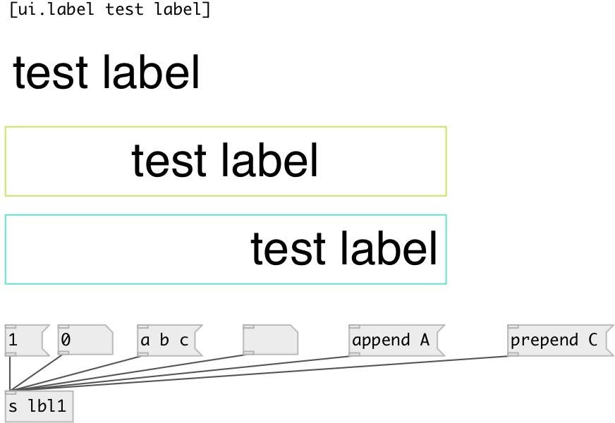

[index](index.html) :: [ui](category_ui.html)
---

# ui.label

###### simple label widget

*available since version:* 0.5

---

## information
With spaces, text-align, font customization and word wrap

## methods:

* **float**
set label text to given float, but do not change @text property 

* **symbol**
set label text to given symbol, but do not change @text property 

* **list**
set label text to given list separated by spaces, but do not change @text
property 

* **any**
set label text to given message separated by spaces, but do not change @text
property 

* **clear**
clear label text and clear @text property 

* **append**
appends to @text end 

* **set**
set label text and update @text property, so it would be saved in patch 

* **prepend**
insert into beginning of @text 

* **pos**
set UI element position 
  __parameters:__
  - **X** top left x-coord 
    type: float  
    required: True  

  - **Y** top right y-coord 
    type: float  
    required: True  

## properties:

* **@text** 
Get/set label text 
__type:__ symbol 
__default:__ Label 

* **@align** 
Get/set text align 
__type:__ symbol 
__enum:__ left, center, right 
__default:__ left 

* **@margin_top** 
Get/set text top margin 
__type:__ int 
__default:__ 5 

* **@margin_left** 
Get/set text left margin 
__type:__ int 
__default:__ 5 

* **@margin_right** 
Get/set text right margin 
__type:__ int 
__default:__ 5 

* **@margin_bottom** 
Get/set text bottom margin 
__type:__ int 
__default:__ 5 

* **@send** 
Get/set send destination 
__type:__ symbol 
__default:__ (null) 

* **@receive** 
Get/set receive source 
__type:__ symbol 
__default:__ (null) 

* **@size** 
Get/set element size (width, height pair) 
__type:__ list 
__default:__ 300 47 

* **@pinned** 
Get/set pin mode. if 1 - put element to the lowest level 
__type:__ int 
__enum:__ 0, 1 
__default:__ 1 

* **@text_color** 
Get/set text color (list of red, green, blue values in 0-1 range) 
__type:__ list 
__default:__ 0 0 0 1 

* **@background_color** 
Get/set element background color (list of red, green, blue values in 0-1 range) 
__type:__ list 
__default:__ 1 1 1 1 

* **@border_color** 
Get/set border color (list of red, green, blue values in 0-1 range) 
__type:__ list 
__default:__ 0.6 0.6 0.6 1 

* **@fontsize** 
Get/set fontsize 
__type:__ int 
__min value:__ 4 
__default:__ 32 

* **@fontname** 
Get/set fontname 
__type:__ symbol 
__default:__ Helvetica 

* **@fontweight** 
Get/set font weight 
__type:__ symbol 
__enum:__ normal, bold 
__default:__ normal 

* **@fontslant** 
Get/set font slant 
__type:__ symbol 
__enum:__ roman, italic 
__default:__ roman 

## keywords:

[ui](keywords/ui.html)
[label](keywords/label.html)

**Authors:** Serge Poltavsky

**License:** GPL3 or later

