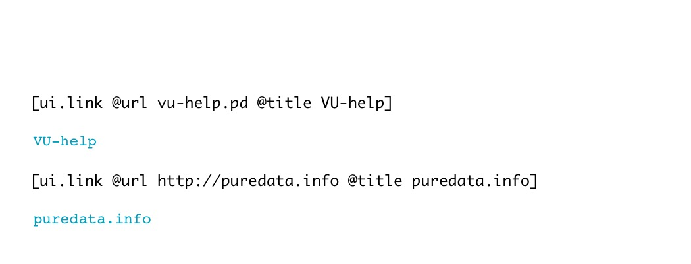

[< reference home](index.html)
---

# ui.link

Hyperlink widget

---

Link allows to open external URLs, not only Pd patches but all kind of URL
            supported by your OS. If relative file path is given, it searched in current directory,
            then Pd doc directory and Pd external directories
 

---

---
arguments:

---
properties:

@url: destination url 
@title: link title 
@send: send destination 
@receive: receive source 
@size: element size (width, height
            pair) 
@pinned: pin mode. if 1 - put element
            to the lowest level 
@hover_color: color when mouse pointer
            is over element (list of red, green, blue values in 0-1 range) 
@link_color: link color (list of
            red, green, blue values in 0-1 range) 
@background_color: element background
            color (list of red, green, blue values in 0-1 range) 
@border_color: border color (list
            of red, green, blue values in 0-1 range) 
@fontsize: 
            fontsize 
@fontname: fontname 
@fontweight: font
            weight 
@fontslant: font
            slant 

