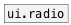

[< reference home](ceammc_lib.html)
---

# ui.matrix


The matrix of toggles has you.

---

Rectangle matrix of toggles. Note: all matrix operations have following cell
            address format - ROW COL.
On click outputs message with format [cell ROW COL VALUE(
<br>


---


```


          [F]          [F]
[dump(    |            |
|         [get row $1( [get col $1(
| [reset( |            |
| |       | [bang(     | [flip( [get list(
| |       | |          | |      |
| |       | |          | |      |
[ui.matrix                      ]
|
|
|
|
[route cell row col]
|    ^|  ^^|   ^^^|
|     |    |      [ui.display @size=60x18]
|     |    |
|     |    [ui.display @size=60x18]
|     |
|     [ui.display @size=60x18]
|
[ui.display @size=60x18]

            
```

---
arguments:

ROW: matrix rows<br>
COL: matrix columns<br>

---
properties:

@rows: number of
            matrix rows<br>
@cols: number of
            matrix columns<br>
@current_row: current row index.
            -1 if not specified. This property is not saved in patch<br>
@current_col: current column
            index. -1 if not specified. This property is not saved in patch<br>
@presetname: preset name for using with
            [ui.preset]<br>
@send: send destination<br>
@receive: receive source<br>
@size: element size (width, height
            pair)<br>
@pinned: pin mode. if 1 - put element
            to the lowest level<br>
@active_color: active color (list of
            red, green, blue values in 0-1 range)<br>
@current_color: current col/row color
            (list of red, green, blue values in 0-1 range)<br>
@background_color: element
            background color (list of red, green, blue values in 0-1 range)<br>
@border_color: border color (list
            of red, green, blue values in 0-1 range)<br>
@fontsize: 
            fontsize<br>
@fontname: fontname<br>
@fontweight: font
            weight<br>
@fontslant: font
            slant<br>

---
see also:<br>
[](ui.radio.html)
[](ui.toggle.html)
