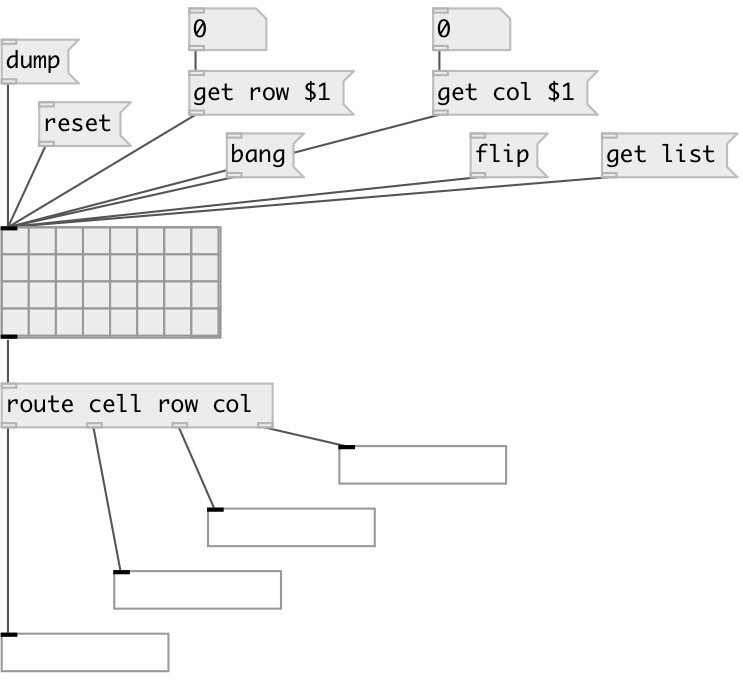

[index](index.html) :: [ui](category_ui.html)
---

# ui.matrix

###### The matrix of toggles has you.

*available since version:* 0.1

---

## information
Rectangle matrix of toggles. Note: all matrix operations have following cell address format - ROW COL. On click outputs message with format [cell ROW COL VALUE(

## arguments:

* **ROW**
matrix rows 
_type:_ int 

* **COL**
matrix columns 
_type:_ int 

## methods:

* **get cell R C**
outputs single cell value as message [cell ROW COL VALUE( 
  __parameters:__
  - **R** row index 
    type: int  
    required: True  

  - **C** column index 
    type: int  
    required: True  

* **get col N**
outputs column cells as message [col N V0 V1...( 
  __parameters:__
  - **N** column index 
    type: int  
    required: True  

* **get row N**
outputs row cells as message [row N V0 V1...( 
  __parameters:__
  - **N** row index 
    type: int  
    required: True  

* **get list**
output all cell values as list, row by raw. [0 1 1 1 0...( 

* **get cols**
output all columns as separate messages [col N V0 V1...( 

* **get rows**
output all rows as separate messages [row N V0 V1...( 

* **get cells**
output all cells as separate messages [cell R C VALUE( 

* **set col N ...**
set specified column without output 
  __parameters:__
  - **N** column index 
    type: int  
    required: True  

  - **...** cell values (1 - checked, 0 - unchecked) 
    type: list  
    required: True  

* **set row N ...**
set specified row without output 
  __parameters:__
  - **N** row index 
    type: int  
    required: True  

  - **...** cell values (1 - checked, 0 - unchecked) 
    type: list  
    required: True  

* **set list ...**
set matrix without output 
  __parameters:__
  - **...** cell values (1 - checked, 0 - unchecked), row by row 
    type: list  
    required: True  

* **flip**
flips all matrix cells 

* **flip col N**
flips cells in specified column. 
  __parameters:__
  - **N** column index 
    type: int  
    required: True  

* **flip row N**
flips cells in specified row. 
  __parameters:__
  - **N** row index 
    type: int  
    required: True  

* **flip R C**
flips single cell 
  __parameters:__
  - **R** row index 
    type: int  
    required: True  

  - **C** column index 
    type: int  
    required: True  

* **random**
fill matrix random and output 

* **dump**
dumps all object info to Pd console window. 

* **reset**
uncheck all matrix cells. No output 

* **read**
 
  __parameters:__
  - **[FNAME]** read matrix values from text file (space separated). If fname argument is not specified opens file chooser dialog 
    type: symbol  

* **write**
 
  __parameters:__
  - **[FNAME]** write matrix values to text file (space separated). If fname argument is not specified opens file chooser dialog 
    type: symbol  

* **load**
loads specified preset 
  __parameters:__
  - **IDX** preset index 
    type: int  
    required: True  

* **store**
stores specified preset 
  __parameters:__
  - **IDX** preset index 
    type: int  
    required: True  

* **clear**
clears specified preset 
  __parameters:__
  - **IDX** preset index 
    type: int  
    required: True  

* **interp**
for this object acts as *load*, no interpolation performed 

* **pos**
set UI element position 
  __parameters:__
  - **X** top left x-coord 
    type: float  
    required: True  

  - **Y** top right y-coord 
    type: float  
    required: True  

## properties:

* **@rows** 
Get/set number of matrix rows 
_type:_ int 
_range:_ 1..64 
_default:_ 4 

* **@cols** 
Get/set number of matrix columns 
_type:_ int 
_range:_ 1..64 
_default:_ 8 

* **@current_row** 
Get/set current row index. -1 if not specified. This property is not saved in patch 
_type:_ int 
_min value:_ -1 
_default:_ -1 

* **@current_col** 
Get/set current column index. -1 if not specified. This property is not saved in patch 
_type:_ int 
_min value:_ -1 
_default:_ -1 

* **@presetname** 
Get/set preset name for using with [ui.preset] 
_type:_ symbol 
_default:_ (null) 

* **@send** 
Get/set send destination 
_type:_ symbol 
_default:_ (null) 

* **@receive** 
Get/set receive source 
_type:_ symbol 
_default:_ (null) 

* **@size** 
Get/set element size (width, height pair) 
_type:_ list 
_default:_ 105 53 

* **@pinned** 
Get/set pin mode. if 1 - put element to the lowest level 
_type:_ bool 
_default:_ 0 

* **@active_color** 
Get/set active color (list of red, green, blue values in 0-1 range) 
_type:_ list 
_default:_ 0 0.75 1 1 

* **@current_color** 
Get/set current col/row color (list of red, green, blue values in 0-1 range) 
_type:_ list 
_default:_ 1 0.75 0 1 

* **@background_color** 
Get/set element background color (list of red, green, blue values in 0-1 range) 
_type:_ list 
_default:_ 0.93 0.93 0.93 1 

* **@border_color** 
Get/set border color (list of red, green, blue values in 0-1 range) 
_type:_ list 
_default:_ 0.6 0.6 0.6 1 

* **@fontsize** 
Get/set fontsize 
_type:_ int 
_range:_ 4..100 
_default:_ 11 

* **@fontname** 
Get/set fontname 
_type:_ symbol 
_enum:_ Courier, DejaVu, Helvetica, Monaco, Times 
_default:_ Helvetica 

* **@fontweight** 
Get/set font weight 
_type:_ symbol 
_enum:_ normal, bold 
_default:_ normal 

* **@fontslant** 
Get/set font slant 
_type:_ symbol 
_enum:_ roman, italic 
_default:_ roman 

## inlets:

* output all cells. Same as [get cells( 
_type:_ control

## outlets:

* output 
_type:_ control

## keywords:

[ui](keywords/ui.html)
[matrix](keywords/matrix.html)

**See also:**
[\[ui.radio\]](ui.radio.html)
[\[ui.toggle\]](ui.toggle.html)

**Authors:** Pierre Guillot, Serge Poltavsky

**License:** GPL3 or later

