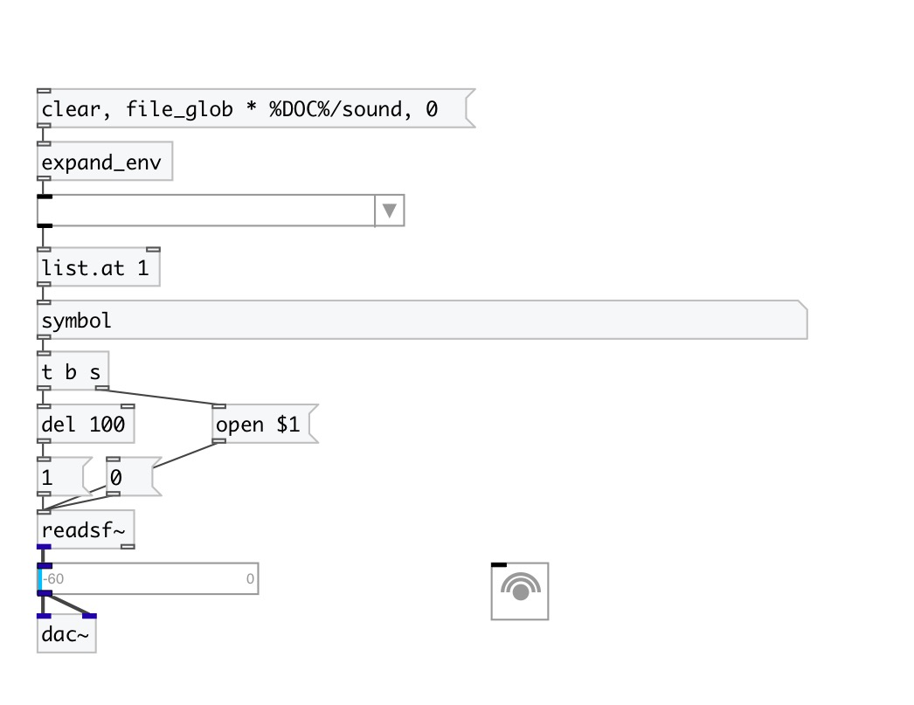

[< reference home](index.html)
---

# ui.menu

Dropdown menu

---

 

---

---
arguments:

---
properties:

@items: list of menu items 
@index: current menu item index 
@value: current menu item value 
@count: number of menu
            items 
@max_length: 
            maximum displayed item character length 
@open: opened state 
@title: current element text 
@presetname: preset name for using with
            [ui.preset] 
@send: send destination 
@receive: receive source 
@size: element size (width, height
            pair) 
@pinned: pin mode. if 1 - put element
            to the lowest level 
@active_color: active color (list of
            red, green, blue values in 0-1 range) 
@text_color: text color (list of red,
            green, blue values in 0-1 range) 
@background_color: element
            background color (list of red, green, blue values in 0-1 range) 
@border_color: border color (list
            of red, green, blue values in 0-1 range) 
@fontsize: 
            fontsize 
@fontname: fontname 
@fontweight: font
            weight 
@fontslant: font
            slant 

---
see also: 

