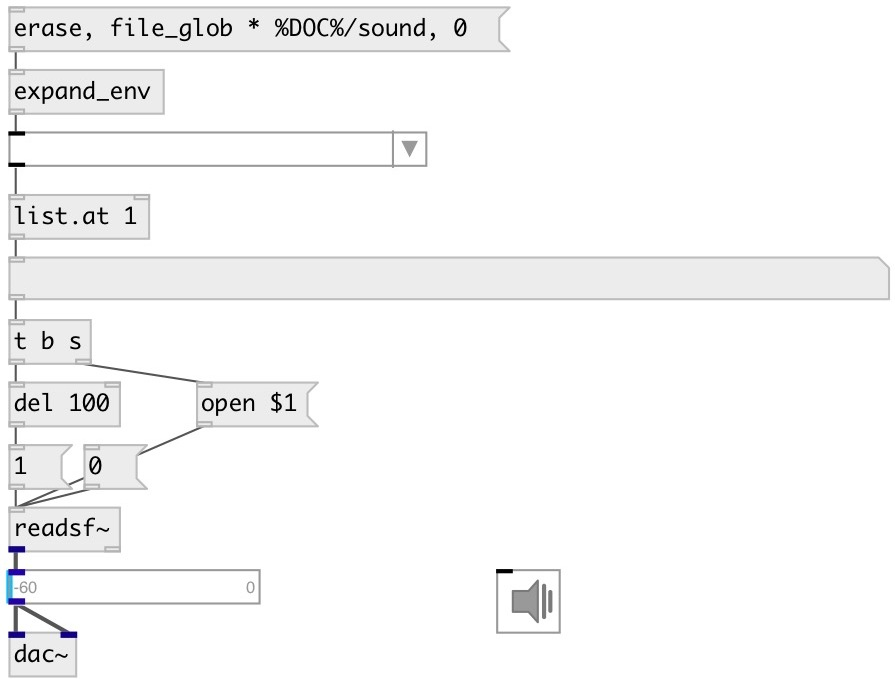

[index](index.html) :: [ui](category_ui.html)
---

# ui.menu

###### Dropdown menu

*available since version:* 0.1

---

## methods:

* **append**
appends new menu item 
  __parameters:__
  - **ATOMS** item name 
    type: list  
    required: True  

* **insert**
inserts new menu item before specified position 
  __parameters:__
  - **IDX** item position 
    type: int  
    required: True  

  - **ATOM** item name 
    type: atom  
    required: True  

* **clear**
clears all items menu 

* **delete**
removes item from menu 
  __parameters:__
  - **IDX** removed item index 
    type: int  
    required: True  

* **set_item**
renames menu item 
  __parameters:__
  - **IDX** item index 
    type: int  
    required: True  

  - **ATOM** item name 
    type: list  
    required: True  

* **set**
silently sets menu state. 
  __parameters:__
  - **IDX** item index 
    type: int  
    required: True  

* **file_glob**
fill menu with filenames. 
  __parameters:__
  - **PATTERN** filename pattern, like * (all files), *.wav (all wav files) etc. 
    type: symbol  
    required: True  

  - **[DIR]** search directory. If omitted - search in patch directory. Performs tilde (~) expansion to home directory. To elide long filenames see @max_length property. 
    type: symbol  

* **load**
loads specified preset 
  __parameters:__
  - **IDX** preset index 
    type: int  
    required: True  

* **store**
stores specified preset 
  __parameters:__
  - **IDX** preset index 
    type: int  
    required: True  

* **interp**
for this object acts as *load*, no interpolation performed 

* **pos**
set UI element position 
  __parameters:__
  - **X** top left x-coord 
    type: float  
    required: True  

  - **Y** top right y-coord 
    type: float  
    required: True  

## properties:

* **@items** 
Get/set list of menu items 
_type:_ list 

* **@index** 
Get/set current menu item index 
_type:_ int 
_default:_ -1 

* **@value** 
Get/set current menu item value 
_type:_ atom 

* **@count** (readonly)
Get number of menu items 
_type:_ int 
_default:_ 0 

* **@max_length** 
Get/set maximum displayed item character length 
_type:_ int 
_range:_ 10..1024 
_default:_ 100 

* **@open** 
Get/set opened state 
_type:_ bool 
_default:_ 0 

* **@title** (readonly)
Get current element text 
_type:_ symbol 

* **@presetname** 
Get/set preset name for using with [ui.preset] 
_type:_ symbol 
_default:_ (null) 

* **@send** 
Get/set send destination 
_type:_ symbol 
_default:_ (null) 

* **@receive** 
Get/set receive source 
_type:_ symbol 
_default:_ (null) 

* **@size** 
Get/set element size (width, height pair) 
_type:_ list 
_default:_ 100 16 

* **@pinned** 
Get/set pin mode. if 1 - put element to the lowest level 
_type:_ bool 
_default:_ 0 

* **@active_color** 
Get/set active color (list of red, green, blue values in 0-1 range) 
_type:_ list 
_default:_ 0 0.75 1 1 

* **@text_color** 
Get/set text color (list of red, green, blue values in 0-1 range) 
_type:_ list 
_default:_ 0 0 0 1 

* **@background_color** 
Get/set element background color (list of red, green, blue values in 0-1 range) 
_type:_ list 
_default:_ 0.93 0.93 0.93 1 

* **@border_color** 
Get/set border color (list of red, green, blue values in 0-1 range) 
_type:_ list 
_default:_ 0.6 0.6 0.6 1 

* **@fontsize** 
Get/set fontsize 
_type:_ int 
_range:_ 4..100 
_default:_ 11 

* **@fontname** 
Get/set fontname 
_type:_ symbol 
_enum:_ Courier, DejaVu, Helvetica, Monaco, Times 
_default:_ Helvetica 

* **@fontweight** 
Get/set font weight 
_type:_ symbol 
_enum:_ normal, bold 
_default:_ normal 

* **@fontslant** 
Get/set font slant 
_type:_ symbol 
_enum:_ roman, italic 
_default:_ roman 

## inlets:

* outputs current menu state as list: INDEX ITEM_NAME 
_type:_ control

## outlets:

* output 
_type:_ control

## keywords:

[ui](keywords/ui.html)
[menu](keywords/menu.html)

**See also:**
[\[ui.radio\]](ui.radio.html)

**Authors:** Pierre Guillot, Serge Poltavsky

**License:** GPL3 or later

