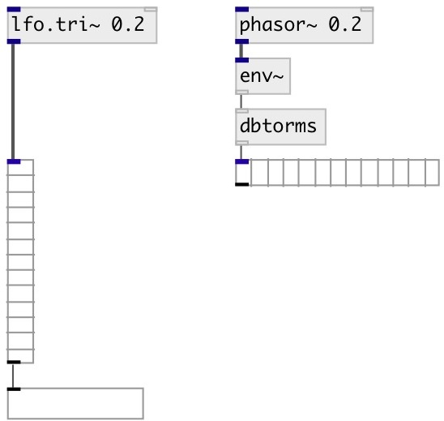

[index](index.html) :: [ui](category_ui.html)
---

# ui.meter~

###### Shows peak and rms signal level

*available since version:* 0.1

---

## information
Each cell has 3db range. Full meter range is 39 db.
Values &gt; -3db are red, range [-12, -3) db is hot, [-21, -12) db is warm, [-30,
            -21) is tepid, values &lt; 30 are cold.
[ui.hm~] - alias for horizontal meter

## methods:

* **pos**
set UI element position 
  __parameters:__
  - **X** top left x-coord 
    type: float  
    required: True  

  - **Y** top right y-coord 
    type: float  
    required: True  

## properties:

* **@interval** 
Get/set refresh interval 
_type:_ int 
_units:_ ms 
_min value:_ 20 
_default:_ 50 

* **@send** 
Get/set send destination 
_type:_ symbol 
_default:_ (null) 

* **@receive** 
Get/set receive source 
_type:_ symbol 
_default:_ (null) 

* **@size** 
Get/set element size (width, height pair) 
_type:_ list 
_default:_ 15 120 

* **@pinned** 
Get/set pin mode. if 1 - put element to the lowest level 
_type:_ int 
_enum:_ 0, 1 
_default:_ 0 

* **@cold_color** 
Get/set extra low-level signal color &lt;-31db (list of red, green, blue values in 0-1
range) 
_type:_ list 
_default:_ 0 0.6 0 1 

* **@tepid_color** 
Get/set low-level signal color &lt;-21db (list of red, green, blue values in 0-1 range) 
_type:_ list 
_default:_ 0.6 0.73 0 1 

* **@warm_color** 
Get/set normal level signal color &lt;-9db (list of red, green, blue values in 0-1 range) 
_type:_ list 
_default:_ 0.85 0.85 0 1 

* **@hot_color** 
Get/set loud level signal color &lt;-3db (list of red, green, blue values in 0-1 range) 
_type:_ list 
_default:_ 1 0.6 0 1 

* **@over_color** 
Get/set extra-loud level signal color &gt;-3db (list of red, green, blue values in 0-1
range) 
_type:_ list 
_default:_ 1 0 0 1 

* **@background_color** 
Get/set element background color (list of red, green, blue values in 0-1 range) 
_type:_ list 
_default:_ 0.93 0.93 0.93 1 

* **@border_color** 
Get/set border color (list of red, green, blue values in 0-1 range) 
_type:_ list 
_default:_ 0.6 0.6 0.6 1 

* **@fontsize** 
Get/set fontsize 
_type:_ int 
_range:_ 4..11 
_default:_ 11 

* **@fontname** 
Get/set fontname 
_type:_ symbol 
_default:_ Helvetica 

* **@fontweight** 
Get/set font weight 
_type:_ symbol 
_enum:_ normal, bold 
_default:_ normal 

* **@fontslant** 
Get/set font slant 
_type:_ symbol 
_enum:_ roman, italic 
_default:_ roman 

## inlets:

* input signal 
_type:_ audio

## outlets:

* output pair of values: rms and peak in decibels (dbfs) 
_type:_ control

## keywords:

[ui](keywords/ui.html)
[meter](keywords/meter.html)

**Authors:** Pierre Guillot, Serge Poltavsky

**License:** GPL3 or later

