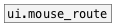
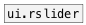

[<<< reference home](ceammc_lib.md)
---

# ui.mouse_filter

```


[ui.rslider @mouse_events 1] [ui.rslider @mouse_events 1]
|                            |
[ui.mouse_filter @up]        [ui.mouse_filter @drag]
|                            |
[ui.display @display_type=1] [ui.display @display_type=1]

[ui.rslider @mouse_events 1]
|
[ui.mouse_filter @down]
|
[ui.display @display_type=1]

            
```
---
filter mouse events from ui objects
---
arguments:


---
properties:

@mouse_up: passing a @mouse_up
            events<br>
@mouse_down: passing a @mouse_down
            events<br>
@mouse_leave: passing a @mouse_leave
            events<br>
@mouse_enter: passing a @mouse_enter
            events<br>
@mouse_move: passing a @mouse_move
            events<br>
@mouse_drag: passing a @mouse_drag
            events<br>
@up: alias to @mouse_up 1 property<br>
@down: alias to @mouse_down 1
            property<br>
@leave: alias to @mouse_leave 1
            property<br>
@enter: alias to @mouse_enter 1
            property<br>
@move: alias to @mouse_move 1
            property<br>
@drag: alias to @mouse_drag 1
            property<br>

---
see also:<br>
[](ui.mouse_route.md)
[](ui.rslider.md)
