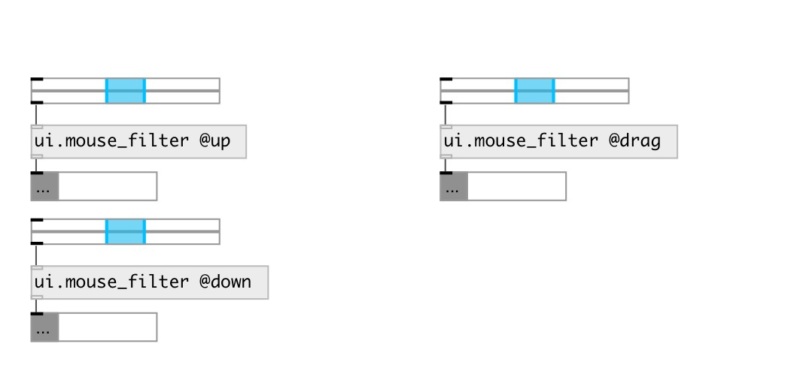

[index](index.html) :: [ui](category_ui.html)
---

# ui.mouse_filter
**aliases:** [ui.mf]

###### filter mouse events from ui objects

*available since version:* 0.8

---

## information
pass only specified mouse events from ui.* objects

## properties:

* **@mouse_up** 
Get/set passing a @mouse_up events 
_type:_ int 
_enum:_ 0, 1 
_default:_ 0 

* **@mouse_down** 
Get/set passing a @mouse_down events 
_type:_ int 
_enum:_ 0, 1 
_default:_ 0 

* **@mouse_leave** 
Get/set passing a @mouse_leave events 
_type:_ int 
_enum:_ 0, 1 
_default:_ 0 

* **@mouse_enter** 
Get/set passing a @mouse_enter events 
_type:_ int 
_enum:_ 0, 1 
_default:_ 0 

* **@mouse_move** 
Get/set passing a @mouse_move events 
_type:_ int 
_enum:_ 0, 1 
_default:_ 0 

* **@mouse_drag** 
Get/set passing a @mouse_drag events 
_type:_ int 
_enum:_ 0, 1 
_default:_ 0 

* **@up** 
Get/set alias to @mouse_up 1 property 
_type:_ alias 
_default:_ 0 

* **@down** 
Get/set alias to @mouse_down 1 property 
_type:_ alias 
_default:_ 0 

* **@leave** 
Get/set alias to @mouse_leave 1 property 
_type:_ alias 
_default:_ 0 

* **@enter** 
Get/set alias to @mouse_enter 1 property 
_type:_ alias 
_default:_ 0 

* **@move** 
Get/set alias to @mouse_move 1 property 
_type:_ alias 
_default:_ 0 

* **@drag** 
Get/set alias to @mouse_drag 1 property 
_type:_ alias 
_default:_ 0 

## inlets:

* input messages from ui object 
_type:_ control

## outlets:

* passed messages from ui object 
_type:_ control

## keywords:

[ui](keywords/ui.html)
[mouse](keywords/mouse.html)
[filter](keywords/filter.html)
[events](keywords/events.html)

**See also:**
[\[ui.mouse_route\]](ui.mouse_route.html)
[\[ui.rslider\]](ui.rslider.html)

**Authors:** Serge Poltavsky

**License:** GPL3 or later

