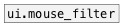

[< reference home](ceammc_lib.html)
---

# ui.mouse_route


routes mouse events from ui objects

---

routes only specified mouse events from ui.* objects<br>


---


```


[ui.hsl @mouse_events 1]
|
[ui.mouse_route @down @up @drag]
|         ^|         ^^|
[F]       [F]        [F]

            
```

---
arguments:


---
properties:

@mouse_up: passing a @mouse_up
            events<br>
@mouse_down: passing a @mouse_down
            events<br>
@mouse_leave: passing a @mouse_leave
            events<br>
@mouse_enter: passing a @mouse_enter
            events<br>
@mouse_move: passing a @mouse_move
            events<br>
@mouse_drag: passing a @mouse_drag
            events<br>
@up: alias to @mouse_up 1 property<br>
@down: alias to @mouse_down 1
            property<br>
@leave: alias to @mouse_leave 1
            property<br>
@enter: alias to @mouse_enter 1
            property<br>
@move: alias to @mouse_move 1
            property<br>
@drag: alias to @mouse_drag 1
            property<br>

---
see also:<br>
[](ui.mouse_filter.html)
[](ui.rslider.html)
