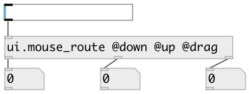

[index](index.html) :: [ui](category_ui.html)
---

# ui.mouse_route

###### routes mouse events from ui objects

*available since version:* 0.8

---

## information
routes only specified mouse events from ui.* objects

## properties:

* **@mouse_up** 
Get/set passing a @mouse_up events 
__type:__ int 
__enum:__ 0, 1 
__default:__ 0 

* **@mouse_down** 
Get/set passing a @mouse_down events 
__type:__ int 
__enum:__ 0, 1 
__default:__ 0 

* **@mouse_leave** 
Get/set passing a @mouse_leave events 
__type:__ int 
__enum:__ 0, 1 
__default:__ 0 

* **@mouse_enter** 
Get/set passing a @mouse_enter events 
__type:__ int 
__enum:__ 0, 1 
__default:__ 0 

* **@mouse_move** 
Get/set passing a @mouse_move events 
__type:__ int 
__enum:__ 0, 1 
__default:__ 0 

* **@mouse_drag** 
Get/set passing a @mouse_drag events 
__type:__ int 
__enum:__ 0, 1 
__default:__ 0 

* **@up** 
Get/set alias to @mouse_up 1 property 
__type:__ alias 
__default:__ 0 

* **@down** 
Get/set alias to @mouse_down 1 property 
__type:__ alias 
__default:__ 0 

* **@leave** 
Get/set alias to @mouse_leave 1 property 
__type:__ alias 
__default:__ 0 

* **@enter** 
Get/set alias to @mouse_enter 1 property 
__type:__ alias 
__default:__ 0 

* **@move** 
Get/set alias to @mouse_move 1 property 
__type:__ alias 
__default:__ 0 

* **@drag** 
Get/set alias to @mouse_drag 1 property 
__type:__ alias 
__default:__ 0 

## inlets:

* input messages from ui object 
__type:__ control 

## outlets:

* first mouse event type match output
__type:__ control 
* ... mouse event type match output
__type:__ control 
* n-th mouse event type match output
__type:__ control 

## keywords:

[ui](keywords/ui.html)
[mouse](keywords/mouse.html)
[filter](keywords/filter.html)
[events](keywords/events.html)

**See also:**
[\[ui.mouse_filter\]](ui.mouse_filter.html)
[\[ui.rslider\]](ui.rslider.html)

**Authors:** Serge Poltavsky

**License:** GPL3 or later

