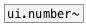

[< reference home](index.html)
---

# ui.number


counterpart of the vanilla [nbx]

---

Display mode: key &#39;-&#39; and &#39;+&#39; increments value. Mouse drag changes value. Default
            step is 1/pixel. Holding SHIFT divide step by 100. Holding CTRL multiply by 10.
Input mode: Double click to enter new value. Accepted keys: -.0123456789. Press
            ENTER or TAB key to finish. ESCAPE undo input, BACKSPACE removes last character.
<br>


---


```


[hsl]
|
| [+ 50( [- 75( [* 2( [/ 3, bang(
| |      |      |     |
| | [++( | [--( |     |
| | |    | |    |     |
| | |    | |    |     | [set -1( [B]
| | |    | |    |     | |        |
[ui.number  @size 200 40          ]
|
|
|
|
[F]

            
```

---
arguments:


---
properties:

@min: minimum value<br>
@max: maximum value<br>
@value: widget value<br>
@digits: number of
            digits. If -1 - no fixed digits used<br>
@presetname: preset name for using with
            [ui.preset]<br>
@send: send destination<br>
@receive: receive source<br>
@size: element size (width, height
            pair)<br>
@pinned: pin mode. if 1 - put element
            to the lowest level<br>
@active_color: active color (list of
            red, green, blue values in 0-1 range)<br>
@text_color: text color (list of red,
            green, blue values in 0-1 range)<br>
@background_color: element
            background color (list of red, green, blue values in 0-1 range)<br>
@border_color: border color (list
            of red, green, blue values in 0-1 range)<br>
@fontsize: 
            fontsize<br>
@fontname: fontname<br>
@fontweight: font
            weight<br>
@fontslant: font
            slant<br>

---
see also:<br>
[](ui.number~.html)
