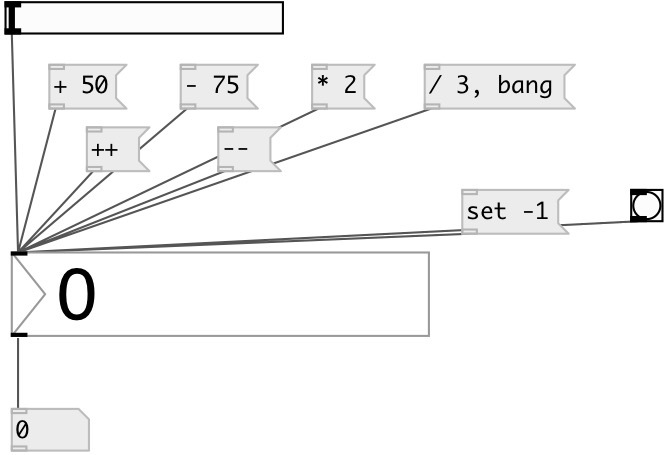

[index](index.html) :: [ui](category_ui.html)
---

# ui.number

###### counterpart of the vanilla [nbx]

*available since version:* 0.1

---

## information
Display mode: keys &#39;-&#39;(Down) and &#39;+&#39;(Up) increment value. Mouse drag changes
            value. Default step is 1/pixel. Holding SHIFT divide step by 100. Holding CTRL multiply
            by 10.
Input mode: Double click to enter new value. Accepted keys: -.0123456789. Press
            ENTER or TAB key to finish. ESCAPE undo input, BACKSPACE removes last character.

## methods:

* **set**
sets slider value without output 
  __parameters:__
  - **V** new value 
    type: float  
    required: True  

* **++**
increment slider value without output 

* **--**
decrement slider value without output 

* **+**
add value to slider without output 
  __parameters:__
  - **V** added value 
    type: float  
    required: True  

* **-**
subtract value from slider without output 
  __parameters:__
  - **V** subtracted value 
    type: float  
    required: True  

* *****
multiply slider value without output 
  __parameters:__
  - **V** multiplied value 
    type: float  
    required: True  

* **/**
divide slider value without output 
  __parameters:__
  - **V** denominator value 
    type: float  
    required: True  

* **load**
loads specified preset 
  __parameters:__
  - **IDX** preset index 
    type: int  
    required: True  

* **store**
stores specified preset 
  __parameters:__
  - **IDX** preset index 
    type: int  
    required: True  

* **clear**
clears specified preset 
  __parameters:__
  - **IDX** preset index 
    type: int  
    required: True  

* **interp**
interplolates between presets 
  __parameters:__
  - **IDX** preset fraction index 
    type: float  
    required: True  

* **pos**
set UI element position 
  __parameters:__
  - **X** top left x-coord 
    type: float  
    required: True  

  - **Y** top right y-coord 
    type: float  
    required: True  

## properties:

* **@min** 
Get/set minimum value 
__type:__ float 
__default:__ -inf 

* **@max** 
Get/set maximum value 
__type:__ float 
__default:__ +inf 

* **@value** 
Get/set widget value 
__type:__ float 
__default:__ 0 

* **@digits** 
Get/set number of digits. If -1 - no fixed digits used 
__type:__ int 
__range:__ -1..9 
__default:__ -1 

* **@presetname** 
Get/set preset name for using with [ui.preset] 
__type:__ symbol 
__default:__ (null) 

* **@send** 
Get/set send destination 
__type:__ symbol 
__default:__ (null) 

* **@receive** 
Get/set receive source 
__type:__ symbol 
__default:__ (null) 

* **@size** 
Get/set element size (width, height pair) 
__type:__ list 
__default:__ 53 15 

* **@pinned** 
Get/set pin mode. if 1 - put element to the lowest level 
__type:__ int 
__enum:__ 0, 1 
__default:__ 0 

* **@active_color** 
Get/set active color (list of red, green, blue values in 0-1 range) 
__type:__ list 
__default:__ 0 0.75 1 1 

* **@text_color** 
Get/set text color (list of red, green, blue values in 0-1 range) 
__type:__ list 
__default:__ 0 0 0 1 

* **@background_color** 
Get/set element background color (list of red, green, blue values in 0-1 range) 
__type:__ list 
__default:__ 0.93 0.93 0.93 1 

* **@border_color** 
Get/set border color (list of red, green, blue values in 0-1 range) 
__type:__ list 
__default:__ 0.6 0.6 0.6 1 

* **@fontsize** 
Get/set fontsize 
__type:__ int 
__range:__ 4..11 
__default:__ 11 

* **@fontname** 
Get/set fontname 
__type:__ symbol 
__default:__ Helvetica 

* **@fontweight** 
Get/set font weight 
__type:__ symbol 
__enum:__ normal, bold 
__default:__ normal 

* **@fontslant** 
Get/set font slant 
__type:__ symbol 
__enum:__ roman, italic 
__default:__ roman 

## inlets:

* outputs current value 
__type:__ control 

## outlets:

* number value
__type:__ control 

## keywords:

[ui](keywords/ui.html)
[number](keywords/number.html)

**See also:**
[\[ui.number~\]](ui.number~.html)

**Authors:** Pierre Guillot, Serge Poltavsky

**License:** GPL3 or later

