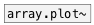

[< reference home](ceammc_lib.html)
---

# ui.plot~


signal plotter

```


[B]
|
[plot.linspace~ -5 5 256 #a {w=50}]
|      |            |     |
[1/x~] [math.exp2~] [^2~] [expr~ sin($v1)*20] [ui.plot~.lin1-help]
|      |            |     |
|      |.           |..   |...
[ui.plot~ @xlabels 1 @ylabels 1 @size 353 250 @n 4 @ymin -40 @ymax 40 #b]


                                              [ui.plot~.lin3-help]


                                              [ui.plot~.log10-help]


                                              [ui.plot~.log2-help]


                                              [ui.plot~.ln-help]


[ui.dsp~]
[X a:1->b:4]

            
```

---
arguments:


---
properties:

@n: number of
            inputs<br>
@ymin: 
            minimal y-axis value<br>
@ymax: 
            minimal y-axis value<br>
@yauto: calculate y-axis range
            automatically<br>
@xlabels: draw labels on
            x-axis<br>
@ylabels: draw labels on
            y-axis<br>
@xmaj_grid: draw major grid lines on
            x-axis<br>
@xmin_grid: draw minor grid lines on
            x-axis<br>
@xmaj_ticks: draw minor ticks on
            x-axis<br>
@xmin_ticks: draw minor ticks on
            x-axis<br>
@ymaj_grid: draw major grid lines on
            y-axis<br>
@ymin_grid: draw minor grid lines on
            y-axis<br>
@ymaj_ticks: draw minor ticks on
            y-axis<br>
@ymin_ticks: draw minor ticks on
            y-axis<br>
@xlabels: draw labels on
            x-axis<br>
@xlabels: draw labels on
            x-axis<br>
@mode: draw
            mode<br>
@send: send destination<br>
@receive: receive source<br>
@size: element size (width, height
            pair)<br>
@pinned: pin mode. if 1 - put element
            to the lowest level<br>
@plot_color0: first plot color (list
            of red, green, blue values in 0-1 range)<br>
@plot_color1: second color (list of
            red, green, blue values in 0-1 range)<br>
@plot_color2: third color (list of
            red, green, blue values in 0-1 range)<br>
@plot_color3: fourth color (list of
            red, green, blue values in 0-1 range)<br>
@background_color: element
            background color (list of red, green, blue values in 0-1 range)<br>
@border_color: border color (list
            of red, green, blue values in 0-1 range)<br>
@fontsize: 
            fontsize<br>
@fontname: fontname<br>
@fontweight: font
            weight<br>
@fontslant: font
            slant<br>

---
see also:<br>
[](array.plot~.html)
