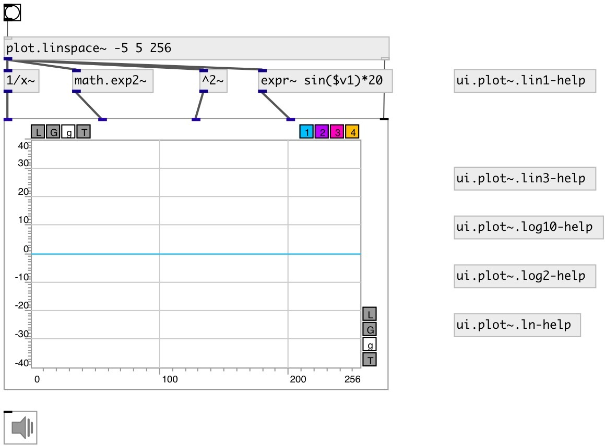

[index](index.html) :: [ui](category_ui.html)
---

# ui.plot~

###### signal plotter

*available since version:* 0.9

---

## methods:

* **plot**
Same as bang: plot default number of samples 

* **pos**
set UI element position 
  __parameters:__
  - **X** top left x-coord 
    type: float  
    required: True  

  - **Y** top right y-coord 
    type: float  
    required: True  

## properties:

* **@n** 
Get/set number of inputs 
_type:_ int 
_range:_ 1..4 
_default:_ 1 

* **@ymin** 
Get/set minimal y-axis value 
_type:_ float 
_range:_ -1024..1024 
_default:_ -1 

* **@ymax** 
Get/set minimal y-axis value 
_type:_ float 
_range:_ -1024..1024 
_default:_ 1 

* **@yauto** 
Get/set calculate y-axis range automatically 
_type:_ int 
_enum:_ 0, 1 
_default:_ 0 

* **@xlabels** 
Get/set draw labels on x-axis 
_type:_ int 
_enum:_ 0, 1 
_default:_ 0 

* **@ylabels** 
Get/set draw labels on y-axis 
_type:_ int 
_enum:_ 0, 1 
_default:_ 0 

* **@xmaj_grid** 
Get/set draw major grid lines on x-axis 
_type:_ int 
_enum:_ 0, 1 
_default:_ 1 

* **@xmin_grid** 
Get/set draw minor grid lines on x-axis 
_type:_ int 
_enum:_ 0, 1 
_default:_ 0 

* **@xmaj_ticks** 
Get/set draw minor ticks on x-axis 
_type:_ int 
_enum:_ 0, 1 
_default:_ 1 

* **@xmin_ticks** 
Get/set draw minor ticks on x-axis 
_type:_ int 
_enum:_ 0, 1 
_default:_ 1 

* **@ymaj_grid** 
Get/set draw major grid lines on y-axis 
_type:_ int 
_enum:_ 0, 1 
_default:_ 1 

* **@ymin_grid** 
Get/set draw minor grid lines on y-axis 
_type:_ int 
_enum:_ 0, 1 
_default:_ 0 

* **@ymaj_ticks** 
Get/set draw minor ticks on y-axis 
_type:_ int 
_enum:_ 0, 1 
_default:_ 1 

* **@ymin_ticks** 
Get/set draw minor ticks on y-axis 
_type:_ int 
_enum:_ 0, 1 
_default:_ 1 

* **@xlabels** 
Get/set draw labels on x-axis 
_type:_ int 
_enum:_ 0, 1 
_default:_ 0 

* **@xlabels** 
Get/set draw labels on x-axis 
_type:_ int 
_enum:_ 0, 1 
_default:_ 0 

* **@mode** 
Get/set draw mode 
_type:_ symbol 
_enum:_ lines, bars 
_default:_ lines 

* **@send** 
Get/set send destination 
_type:_ symbol 
_default:_ (null) 

* **@receive** 
Get/set receive source 
_type:_ symbol 
_default:_ (null) 

* **@size** 
Get/set element size (width, height pair) 
_type:_ list 
_default:_ 200 200 

* **@pinned** 
Get/set pin mode. if 1 - put element to the lowest level 
_type:_ int 
_enum:_ 0, 1 
_default:_ 0 

* **@plot_color0** 
Get/set first plot color (list of red, green, blue values in 0-1 range) 
_type:_ list 
_default:_ 0 0.75 1 1 

* **@plot_color1** 
Get/set second color (list of red, green, blue values in 0-1 range) 
_type:_ list 
_default:_ 0.75 0 1 1 

* **@plot_color2** 
Get/set third color (list of red, green, blue values in 0-1 range) 
_type:_ list 
_default:_ 1 0 0.75 1 

* **@plot_color3** 
Get/set fourth color (list of red, green, blue values in 0-1 range) 
_type:_ list 
_default:_ 1 0.75 0 1 

* **@background_color** 
Get/set element background color (list of red, green, blue values in 0-1 range) 
_type:_ list 
_default:_ 0.93 0.93 0.93 1 

* **@border_color** 
Get/set border color (list of red, green, blue values in 0-1 range) 
_type:_ list 
_default:_ 0.6 0.6 0.6 1 

* **@fontsize** 
Get/set fontsize 
_type:_ int 
_range:_ 4..11 
_default:_ 11 

* **@fontname** 
Get/set fontname 
_type:_ symbol 
_default:_ Helvetica 

* **@fontweight** 
Get/set font weight 
_type:_ symbol 
_enum:_ normal, bold 
_default:_ normal 

* **@fontslant** 
Get/set font slant 
_type:_ symbol 
_enum:_ roman, italic 
_default:_ roman 

## inlets:

* input signal 
_type:_ audio
* plot default number of samples 
_type:_ control

## keywords:

[plot](keywords/plot.html)

**See also:**
[\[array.plot~\]](array.plot~.html)

**Authors:** Serge Poltavsky

**License:** GPL3 or later

