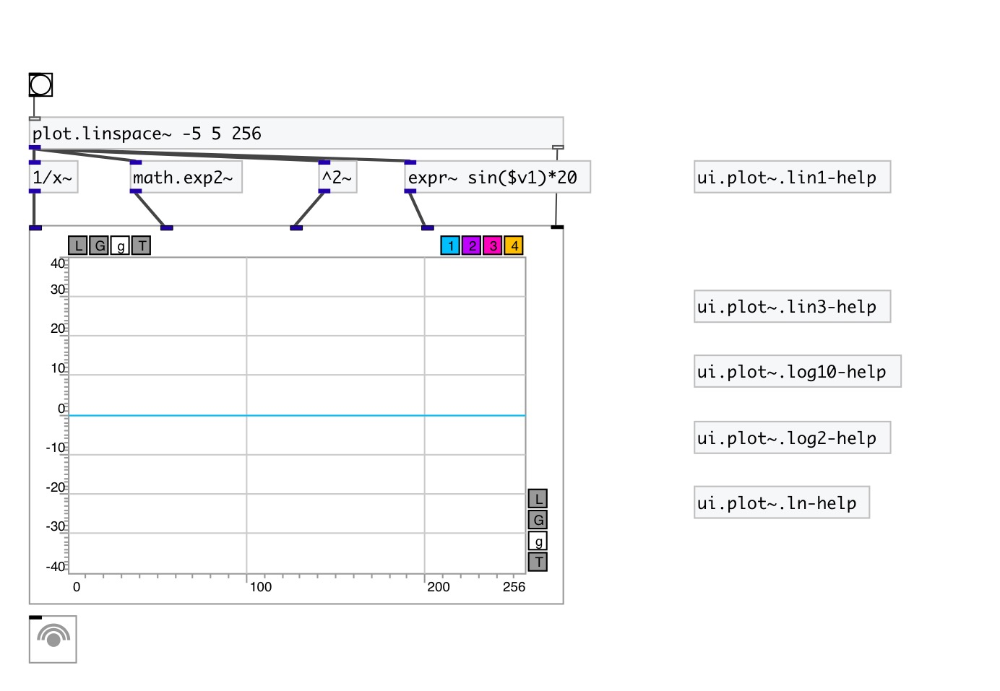

[< reference home](index.html)
---

# ui.plot~

signal plotter

---

 

---

---
arguments:

---
properties:

@n: number of
            inputs 
@ymin: 
            minimal y-axis value 
@ymax: 
            minimal y-axis value 
@yauto: calculate y-axis range
            automatically 
@xlabels: draw labels on
            x-axis 
@ylabels: draw labels on
            y-axis 
@xmaj_grid: draw major grid lines on
            x-axis 
@xmin_grid: draw minor grid lines on
            x-axis 
@xmaj_ticks: draw minor ticks on
            x-axis 
@xmin_ticks: draw minor ticks on
            x-axis 
@ymaj_grid: draw major grid lines on
            y-axis 
@ymin_grid: draw minor grid lines on
            y-axis 
@ymaj_ticks: draw minor ticks on
            y-axis 
@ymin_ticks: draw minor ticks on
            y-axis 
@xlabels: draw labels on
            x-axis 
@xlabels: draw labels on
            x-axis 
@mode: draw
            mode 
@send: send destination 
@receive: receive source 
@size: element size (width, height
            pair) 
@pinned: pin mode. if 1 - put element
            to the lowest level 
@plot_color0: first plot color (list
            of red, green, blue values in 0-1 range) 
@plot_color1: second color (list of
            red, green, blue values in 0-1 range) 
@plot_color2: third color (list of
            red, green, blue values in 0-1 range) 
@plot_color3: fourth color (list of
            red, green, blue values in 0-1 range) 
@background_color: element
            background color (list of red, green, blue values in 0-1 range) 
@border_color: border color (list
            of red, green, blue values in 0-1 range) 
@fontsize: 
            fontsize 
@fontname: fontname 
@fontweight: font
            weight 
@fontslant: font
            slant 

---
see also: 

