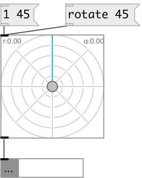

[index](index.html) :: [ui](category_ui.html)
---

# ui.polar

###### 2D slider in polar coordinates

*available since version:* 0.8

---

## methods:

* **dump**
dumps all object info to Pd console window 

* **set**
sets slider position without output 
  __parameters:__
  - **RAD** radius 
    type: float  
    required: True  

  - **ANG** angle in degrees or radians (depends on @use_degrees property) 
    type: float  
    required: True  

* **polar**
sets slider position in polar coords and output 
  __parameters:__
  - **RAD** radius 
    type: float  
    required: True  

  - **ANG** angle in degrees or radians (depends on @use_degrees property) 
    type: float  
    required: True  

* **cartesian**
sets slider position in cartesian coords and output 
  __parameters:__
  - **X** x-coord 
    type: float  
    required: True  

  - **Y** y-coord 
    type: float  
    required: True  

* **rotate**
rotate slider by specified angle 
  __parameters:__
  - **A** angle in degrees or radians (depends on @use_degrees property) 
    type: float  
    required: True  

* **random**
set to random value and output 

* **load**
loads specified preset 
  __parameters:__
  - **IDX** preset index 
    type: int  
    required: True  

* **store**
stores specified preset 
  __parameters:__
  - **IDX** preset index 
    type: int  
    required: True  

* **clear**
clears specified preset 
  __parameters:__
  - **IDX** preset index 
    type: int  
    required: True  

* **interp**
interplolates between presets 
  __parameters:__
  - **IDX** preset fraction index 
    type: float  
    required: True  

* **pos**
set UI element position 
  __parameters:__
  - **X** top left x-coord 
    type: float  
    required: True  

  - **Y** top right y-coord 
    type: float  
    required: True  

## properties:

* **@clockwise** 
Get/set clockwise positive direction 
__type:__ int 
__enum:__ 0, 1 
__default:__ 1 

* **@direction** 
Get/set zero-angle direction 
__type:__ symbol 
__enum:__ N, E, S, W 
__default:__ N 

* **@positive** 
Get/set use positive output angle range. For example: [0..360) when using degrees,
otherwise using [-180..180) range. 
__type:__ int 
__enum:__ 0, 1 
__default:__ 0 

* **@radians** 
Get/set using radians instead of degrees 
__type:__ int 
__enum:__ 0, 1 
__default:__ 0 

* **@angle** 
Get/set angle 
__type:__ float 
__default:__ 0 

* **@radius** 
Get/set radius 
__type:__ float 
__range:__ 0..1 
__default:__ 0 

* **@presetname** 
Get/set preset name for using with [ui.preset] 
__type:__ symbol 
__default:__ (null) 

* **@send** 
Get/set send destination 
__type:__ symbol 
__default:__ (null) 

* **@receive** 
Get/set receive source 
__type:__ symbol 
__default:__ (null) 

* **@size** 
Get/set element size (width, height pair) 
__type:__ list 
__default:__ 100 100 

* **@pinned** 
Get/set pin mode. if 1 - put element to the lowest level 
__type:__ int 
__enum:__ 0, 1 
__default:__ 0 

* **@mouse_events** 
Get/set mouse events output mode. If on outputs @mouse_down, @mouse_up and @mouse_drag
events 
__type:__ int 
__enum:__ 0, 1 
__default:__ 0 

* **@background_color** 
Get/set element background color (list of red, green, blue values in 0-1 range) 
__type:__ list 
__default:__ 0.93 0.93 0.93 1 

* **@border_color** 
Get/set border color (list of red, green, blue values in 0-1 range) 
__type:__ list 
__default:__ 0.6 0.6 0.6 1 

* **@fontsize** 
Get/set fontsize 
__type:__ int 
__range:__ 4..11 
__default:__ 11 

* **@fontname** 
Get/set fontname 
__type:__ symbol 
__default:__ Helvetica 

* **@fontweight** 
Get/set font weight 
__type:__ symbol 
__enum:__ normal, bold 
__default:__ normal 

* **@fontslant** 
Get/set font slant 
__type:__ symbol 
__enum:__ roman, italic 
__default:__ roman 

* **@label** 
Get/set label text 
__type:__ symbol 
__default:__ (null) 

* **@label_color** 
Get/set label color in RGB format within 0-1 range, for example: 0.2 0.4 0.1 
__type:__ list 
__default:__ 0 0 0 1 

* **@label_inner** 
Get/set label position (1 - inner, 0 - outer). 
__type:__ int 
__enum:__ 0, 1 
__default:__ 0 

* **@label_align** 
Get/set label horizontal align 
__type:__ symbol 
__enum:__ left, center, right 
__default:__ left 

* **@label_valign** 
Get/set label vertical align 
__type:__ symbol 
__enum:__ top, center, bottom 
__default:__ top 

* **@label_side** 
Get/set label snap side 
__type:__ symbol 
__enum:__ left, top, right, bottom 
__default:__ top 

* **@label_margins** 
Get/set label offset in pixels 
__type:__ list 
__default:__ 0 0 

## inlets:

* outputs slider position 
__type:__ control 

## outlets:

* list output of two values: RADIUS and ANGLE
__type:__ control 

## keywords:

[ui](keywords/ui.html)
[slider](keywords/slider.html)
[polar](keywords/polar.html)

**See also:**
[\[ui.slider2d\]](ui.slider2d.html)

**Authors:** Serge Poltavsky

**License:** GPL3 or later

