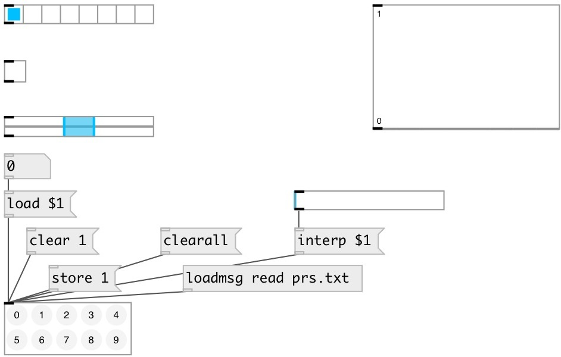

[index](index.html) :: [ui](category_ui.html)
---

# ui.preset

###### Preset manager

*available since version:* 0.1

---

## information
Saves presets value of UI objects that have @presetname property. Can handle UI objects only on the save canvas, no subpatches or abstractions are supported. NOTE: if no UI widgets with @presetname on canvas - *Shift-click* is disabled. Active slot is highlighted, available slots are dark gray

## methods:

* **clear**
clear specified preset 
  __parameters:__
  - **IDX** preset index 
    type: int  
    required: True  

* **clearall**
clear all existing presets 

* **load**
loads specified preset 
  __parameters:__
  - **IDX** preset index 
    type: int  
    required: True  

* **interp**
loads linearry interpolated value between preset, for example: 1.5 means load
interpolated value between preset 1 and 2. 
  __parameters:__
  - **IDX** preset interpolation index 
    type: float  
    required: True  

* **store**
stores specified preset 
  __parameters:__
  - **IDX** preset index 
    type: int  
    required: True  

* **read**
read presets from file 
  __parameters:__
  - **PATH** path to preset file 
    type: symbol  
    required: True  

* **write**
read presets from file 
  __parameters:__
  - **PATH** path to preset file 
    type: symbol  
    required: True  

* **duplicate**
fill empty presets by coping exiting values 

* **pos**
set UI element position 
  __parameters:__
  - **X** top left x-coord 
    type: float  
    required: True  

  - **Y** top right y-coord 
    type: float  
    required: True  

## properties:

* **@current** (readonly)
Get current preset index 
_type:_ int 
_default:_ -1 

* **@receive** 
Get/set receive source 
_type:_ symbol 
_default:_ (null) 

* **@size** 
Get/set element size (width, height pair) 
_type:_ list 
_default:_ 102 42 

* **@pinned** 
Get/set pin mode. if 1 - put element to the lowest level 
_type:_ bool 
_default:_ 0 

* **@active_color** 
Get/set active color (list of red, green, blue values in 0-1 range) 
_type:_ list 
_default:_ 0 0.75 1 1 

* **@text_color** 
Get/set text color (list of red, green, blue values in 0-1 range) 
_type:_ list 
_default:_ 0 0 0 1 

* **@empty_color** 
Get/set empty cell color (list of red, green, blue values in 0-1 range) 
_type:_ list 
_default:_ 0.86 0.86 0.86 1 

* **@stored_color** 
Get/set stored cell color (list of red, green, blue values in 0-1 range) 
_type:_ list 
_default:_ 0.5 0.5 0.5 1 

* **@background_color** 
Get/set element background color (list of red, green, blue values in 0-1 range) 
_type:_ list 
_default:_ 0.93 0.93 0.93 1 

* **@border_color** 
Get/set border color (list of red, green, blue values in 0-1 range) 
_type:_ list 
_default:_ 0.6 0.6 0.6 1 

* **@fontsize** 
Get/set fontsize 
_type:_ int 
_range:_ 4..100 
_default:_ 11 

* **@fontname** 
Get/set fontname 
_type:_ symbol 
_enum:_ Courier, DejaVu, Helvetica, Monaco, Times 
_default:_ Helvetica 

* **@fontweight** 
Get/set font weight 
_type:_ symbol 
_enum:_ normal, bold 
_default:_ normal 

* **@fontslant** 
Get/set font slant 
_type:_ symbol 
_enum:_ roman, italic 
_default:_ roman 

## inlets:

_type:_ control

## keywords:

[ui](keywords/ui.html)
[preset](keywords/preset.html)

**See also:**
[\[preset.float\]](preset.float.html)
[\[preset.storage\]](preset.storage.html)

**Authors:** Pierre Guillot, Serge Poltavsky

**License:** GPL3 or later

