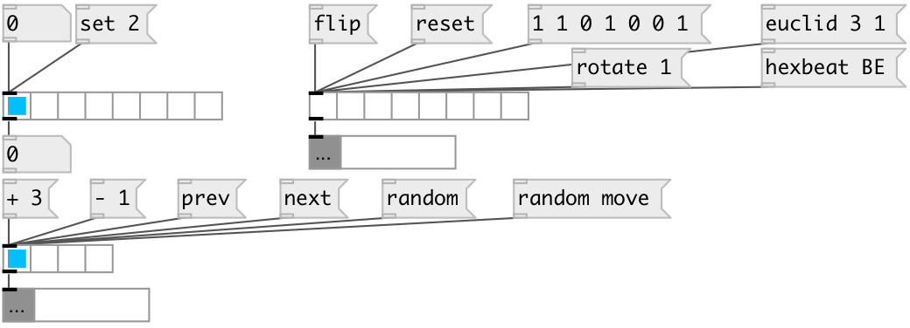

[index](index.html) :: [ui](category_ui.html)
---

# ui.radio
**aliases:** [ui.radio*], [ui.hrd], [ui.hrd*], [ui.vrd], [ui.vrd*]

###### counterpart of the vanilla radio toggle

*available since version:* 0.1

---

## information
[ui.hrd] alias for horizontal radio, [ui.vrd] alias for vertical radio, [ui.hrd*] alias for horizontal radio checklist.

## arguments:

* **NCELLS**
number of cells 
_type:_ float 

## methods:

* **set**
sets radio without output 
  __parameters:__
  - **V** new value 
    type: float  
    required: True  

* **reset**
reset radio (only in checklist mode) 

* **random**
select random cells. If called as [random move( moves to another random cell
(excluding the current one) 

* **flip**
flips radio (only in checklist mode) 

* **next**
moves to next position until last cell is reached (single mode only) 

* **prev**
moves to previous position until first cell is reached (single mode only) 

* **+ STEP**
moves several steps forward on a loop (single mode only) 

* **- STEP**
moves several step backwards on a loop (single mode only) 

* **load**
loads specified preset 
  __parameters:__
  - **IDX** preset index 
    type: int  
    required: True  

* **store**
stores specified preset 
  __parameters:__
  - **IDX** preset index 
    type: int  
    required: True  

* **clear**
clears specified preset 
  __parameters:__
  - **IDX** preset index 
    type: int  
    required: True  

* **interp**
for this object acts as *load*, no interpolation performed 

* **pos**
set UI element position 
  __parameters:__
  - **X** top left x-coord 
    type: float  
    required: True  

  - **Y** top right y-coord 
    type: float  
    required: True  

## properties:

* **@nitems** 
Get/set number of items 
_type:_ int 
_range:_ 2..128 
_default:_ 8 

* **@mode** 
Get/set check list mode. If true acts as checklist 
_type:_ bool 
_default:_ 0 

* **@value** 
Get/set widget value (float or list) 
_type:_ list 

* **@presetname** 
Get/set preset name for using with [ui.preset] 
_type:_ symbol 
_default:_ (null) 

* **@send** 
Get/set send destination 
_type:_ symbol 
_default:_ (null) 

* **@receive** 
Get/set receive source 
_type:_ symbol 
_default:_ (null) 

* **@size** 
Get/set element size (width, height pair) 
_type:_ list 
_default:_ 120 15 

* **@pinned** 
Get/set pin mode. if 1 - put element to the lowest level 
_type:_ bool 
_default:_ 0 

* **@active_color** 
Get/set active color (list of red, green, blue values in 0-1 range) 
_type:_ list 
_default:_ 0 0.75 1 1 

* **@background_color** 
Get/set element background color (list of red, green, blue values in 0-1 range) 
_type:_ list 
_default:_ 0.93 0.93 0.93 1 

* **@border_color** 
Get/set border color (list of red, green, blue values in 0-1 range) 
_type:_ list 
_default:_ 0.6 0.6 0.6 1 

* **@fontsize** 
Get/set fontsize 
_type:_ int 
_range:_ 4..100 
_default:_ 11 

* **@fontname** 
Get/set fontname 
_type:_ symbol 
_enum:_ Courier, DejaVu, Helvetica, Monaco, Times 
_default:_ Helvetica 

* **@fontweight** 
Get/set font weight 
_type:_ symbol 
_enum:_ normal, bold 
_default:_ normal 

* **@fontslant** 
Get/set font slant 
_type:_ symbol 
_enum:_ roman, italic 
_default:_ roman 

* **@mouse_events** 
Get/set mouse events output mode. If on outputs @mouse_down and @mouse_drag events 
_type:_ bool 
_default:_ 0 

## inlets:

* outputs current radio state 
_type:_ control

## outlets:

* output value 
_type:_ control

## keywords:

[ui](keywords/ui.html)
[radio](keywords/radio.html)

**See also:**
[\[ui.matrix\]](ui.matrix.html)

**Authors:** Pierre Guillot

**License:** GPL3 or later

