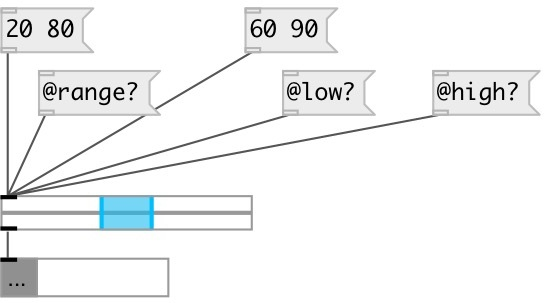

[index](index.html) :: [ui](category_ui.html)
---

# ui.rslider
**aliases:** [ui.rsl]

###### range slider

*available since version:* 0.1

---

## information
By default outputs messages on mouse click, mouse up and dragging To output messages only on specified event use: @mouse_events=1 and [ui.mouse_filter]

## methods:

* **set**
sets slider value without output 
  __parameters:__
  - **V** new value 
    type: float  
    required: True  

* **load**
loads specified preset 
  __parameters:__
  - **IDX** preset index 
    type: int  
    required: True  

* **store**
stores specified preset 
  __parameters:__
  - **IDX** preset index 
    type: int  
    required: True  

* **clear**
clears specified preset 
  __parameters:__
  - **IDX** preset index 
    type: int  
    required: True  

* **interp**
interplolates between presets 
  __parameters:__
  - **IDX** preset fraction index 
    type: float  
    required: True  

* **pos**
set UI element position 
  __parameters:__
  - **X** top left x-coord 
    type: float  
    required: True  

  - **Y** top right y-coord 
    type: float  
    required: True  

## properties:

* **@min** 
Get/set minimum allowed slider value 
_type:_ float 
_default:_ 0 

* **@max** 
Get/set maximum allowed slider value 
_type:_ float 
_default:_ 1 

* **@value** 
Get/set current slider value 
_type:_ list 

* **@low** 
Get/set low (left) selection value 
_type:_ float 
_default:_ 0 

* **@high** 
Get/set max (right) selection value 
_type:_ float 
_default:_ 0 

* **@range** (readonly)
Get selected slider value 
_type:_ float 
_min value:_ 0 
_default:_ 0 

* **@presetname** 
Get/set preset name for using with [ui.preset] 
_type:_ symbol 
_default:_ (null) 

* **@send** 
Get/set send destination 
_type:_ symbol 
_default:_ (null) 

* **@receive** 
Get/set receive source 
_type:_ symbol 
_default:_ (null) 

* **@size** 
Get/set element size (width, height pair) 
_type:_ list 
_default:_ 120 15 

* **@pinned** 
Get/set pin mode. if 1 - put element to the lowest level 
_type:_ int 
_enum:_ 0, 1 
_default:_ 0 

* **@mouse_events** 
Get/set mouse events output mode. If on outputs @mouse_down, @mouse_up and @mouse_drag
events 
_type:_ int 
_enum:_ 0, 1 
_default:_ 0 

* **@knob_color** 
Get/set knob color (list of red, green, blue values in 0-1 range) 
_type:_ list 
_default:_ 0 0.75 1 1 

* **@background_color** 
Get/set element background color (list of red, green, blue values in 0-1 range) 
_type:_ list 
_default:_ 0.93 0.93 0.93 1 

* **@border_color** 
Get/set border color (list of red, green, blue values in 0-1 range) 
_type:_ list 
_default:_ 0.6 0.6 0.6 1 

* **@fontsize** 
Get/set fontsize 
_type:_ int 
_range:_ 4..11 
_default:_ 11 

* **@fontname** 
Get/set fontname 
_type:_ symbol 
_default:_ Helvetica 

* **@fontweight** 
Get/set font weight 
_type:_ symbol 
_enum:_ normal, bold 
_default:_ normal 

* **@fontslant** 
Get/set font slant 
_type:_ symbol 
_enum:_ roman, italic 
_default:_ roman 

* **@label** 
Get/set label text 
_type:_ symbol 
_default:_ (null) 

* **@label_color** 
Get/set label color in RGB format within 0-1 range, for example: 0.2 0.4 0.1 
_type:_ list 
_default:_ 0 0 0 1 

* **@label_inner** 
Get/set label position (1 - inner, 0 - outer). 
_type:_ int 
_enum:_ 0, 1 
_default:_ 0 

* **@label_align** 
Get/set label horizontal align 
_type:_ symbol 
_enum:_ left, center, right 
_default:_ left 

* **@label_valign** 
Get/set label vertical align 
_type:_ symbol 
_enum:_ top, center, bottom 
_default:_ top 

* **@label_side** 
Get/set label snap side 
_type:_ symbol 
_enum:_ left, top, right, bottom 
_default:_ top 

* **@label_margins** 
Get/set label offset in pixels 
_type:_ list 
_default:_ 0 0 

## inlets:

* outputs current slider state 
_type:_ control

## outlets:

* output slider range as pair of values 
_type:_ control

## keywords:

[ui](keywords/ui.html)
[range](keywords/range.html)
[slider](keywords/slider.html)

**See also:**
[\[ui.slider\]](ui.slider.html)
[\[ui.sliders\]](ui.sliders.html)

**Authors:** Pierre Guillot, Serge Poltavsky

**License:** GPL3 or later

