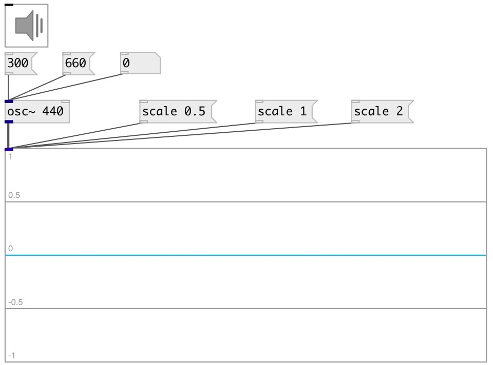

[index](index.html) :: [ui](category_ui.html)
---

# ui.scope~

###### Scope GUI object

*available since version:* 0.1

---

## methods:

* **freeze**
stop/start processing 
  __parameters:__
  - **[V]** 1 - freeze, 0 - unfreeze 
    type: int  

* **scale**
sets widget scale 
  __parameters:__
  - **[N]** 1 - normal scale, 2 - range from -2..2 (zoomout), 0.1 - range from -0.1..0.1 (zoomin) 
    type: float  

* **pos**
set UI element position 
  __parameters:__
  - **X** top left x-coord 
    type: float  
    required: True  

  - **Y** top right y-coord 
    type: float  
    required: True  

## properties:

* **@max** 
Get/set maximum (top) graph value 
_type:_ float 
_default:_ 1 

* **@min** 
Get/set minimum (bottom) graph value 
_type:_ float 
_default:_ -1 

* **@window** 
Get/set window size 
_type:_ int 
_range:_ 512..4096 
_default:_ 2048 

* **@refresh** 
Get/set approximate refresh rate 
_type:_ int 
_units:_ ms 
_range:_ 10..1000 
_default:_ 40 

* **@send** 
Get/set send destination 
_type:_ symbol 
_default:_ (null) 

* **@receive** 
Get/set receive source 
_type:_ symbol 
_default:_ (null) 

* **@size** 
Get/set element size (width, height pair) 
_type:_ list 
_default:_ 150 100 

* **@pinned** 
Get/set pin mode. if 1 - put element to the lowest level 
_type:_ int 
_enum:_ 0, 1 
_default:_ 0 

* **@active_color** 
Get/set active color (list of red, green, blue values in 0-1 range) 
_type:_ list 
_default:_ 0 0.75 1 1 

* **@background_color** 
Get/set element background color (list of red, green, blue values in 0-1 range) 
_type:_ list 
_default:_ 0.93 0.93 0.93 1 

* **@border_color** 
Get/set border color (list of red, green, blue values in 0-1 range) 
_type:_ list 
_default:_ 0.6 0.6 0.6 1 

* **@fontsize** 
Get/set fontsize 
_type:_ int 
_range:_ 4..11 
_default:_ 11 

* **@fontname** 
Get/set fontname 
_type:_ symbol 
_default:_ Helvetica 

* **@fontweight** 
Get/set font weight 
_type:_ symbol 
_enum:_ normal, bold 
_default:_ normal 

* **@fontslant** 
Get/set font slant 
_type:_ symbol 
_enum:_ roman, italic 
_default:_ roman 

## inlets:

* signal input 
_type:_ control

## keywords:

[ui](keywords/ui.html)
[scope](keywords/scope.html)

**See also:**
[\[ui.spectroscope~\]](ui.spectroscope~.html)

**Authors:** Alex Nadzharov, Serge Poltavsky

**License:** GPL3 or later

