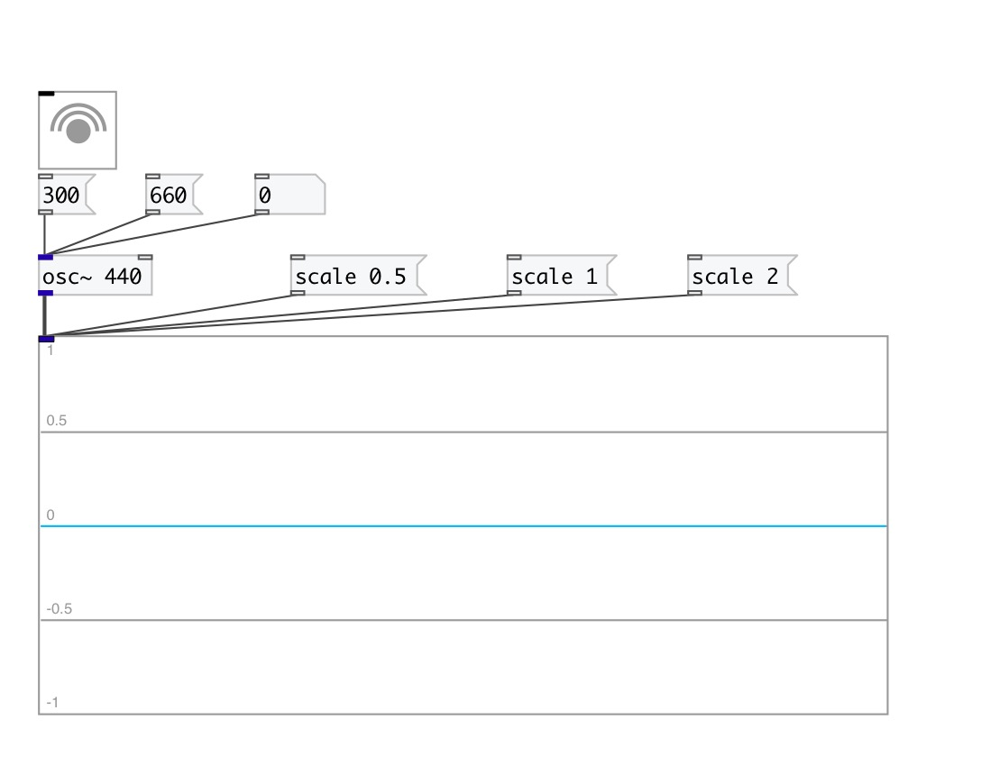

[< reference home](index.html)
---

# ui.scope~

Scope GUI object

---

 

---

---
arguments:

---
properties:

@max: maximum (top) graph value 
@min: minimum (bottom) graph value 
@window: 
            window size 
@refresh(ms): approximate refresh rate 
@send: send destination 
@receive: receive source 
@size: element size (width, height
            pair) 
@pinned: pin mode. if 1 - put element
            to the lowest level 
@active_color: active color (list of
            red, green, blue values in 0-1 range) 
@background_color: element
            background color (list of red, green, blue values in 0-1 range) 
@border_color: border color (list
            of red, green, blue values in 0-1 range) 
@fontsize: 
            fontsize 
@fontname: fontname 
@fontweight: font
            weight 
@fontslant: font
            slant 

---
see also: 

