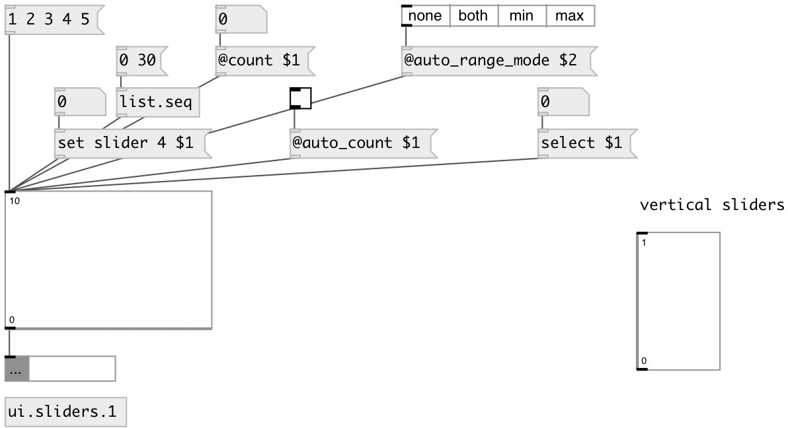

[index](index.html) :: [ui](category_ui.html)
---

# ui.sliders

###### Multiple slider widget

*available since version:* 0.1

---

## arguments:

* **N**
number of sliders 
__type:__ float 

## methods:

* **dump**
dumps all object info to Pd console window 

* **select**
draws specified slider with select color 
  __parameters:__
  - **N** slider index, starting from 0. 
    type: int  
    required: True  

* **random**
fill sliders with random values without output 

* **linup**
fill sliders with increasing values without output 

* **lindown**
fill sliders with decreasing values without output 

* **fill**
fill sliders value with specified value without output 

* **set**
sets sliders values without output 
  __parameters:__
  - **[VALUES]** slider values 
    type: list  

* **get slider N**
get specified slider value 
  __parameters:__
  - **N** slider position, starting from 0 
    type: int  
    required: True  

* **set slider N V**
sets specified slider value 
  __parameters:__
  - **N** slider position, starting from 0 
    type: int  
    required: True  

  - **V** slider value 
    type: float  
    required: True  

* **++**
increment all sliders without output 

* **--**
decrement all sliders without output 

* **+**
add value to every slider without output 
  __parameters:__
  - **V** added value 
    type: float  
    required: True  

* **-**
subtract value from every slider without output 
  __parameters:__
  - **V** subtracted value 
    type: float  
    required: True  

* *****
multiply each slider without output 
  __parameters:__
  - **V** multiplied value 
    type: float  
    required: True  

* **/**
divide each slider without output 
  __parameters:__
  - **V** denominator value 
    type: float  
    required: True  

* **load**
loads specified preset 
  __parameters:__
  - **IDX** preset index 
    type: int  
    required: True  

* **store**
stores specified preset 
  __parameters:__
  - **IDX** preset index 
    type: int  
    required: True  

* **clear**
clears specified preset 
  __parameters:__
  - **IDX** preset index 
    type: int  
    required: True  

* **interp**
interplolates between presets 
  __parameters:__
  - **IDX** preset fraction index 
    type: float  
    required: True  

* **pos**
set UI element position 
  __parameters:__
  - **X** top left x-coord 
    type: float  
    required: True  

  - **Y** top right y-coord 
    type: float  
    required: True  

## properties:

* **@count** 
Get/set number of sliders 
__type:__ int 
__range:__ 1..1024 
__default:__ 8 

* **@min** 
Get/set minimal value 
__type:__ float 
__default:__ 0 

* **@max** 
Get/set maximum value 
__type:__ float 
__default:__ 1 

* **@range** (readonly)
Get value range 
__type:__ float 
__default:__ 0 

* **@value** (readonly)
Get sliders value 
__type:__ list 

* **@auto_count** 
Get/set if set numbers of sliders equal to input list length 
__type:__ int 
__enum:__ 0, 1 
__default:__ 0 

* **@auto_range_mode** 
Get/set if calculate @min/@max values automatically 
__type:__ symbol 
__enum:__ none, both, min, max 
__default:__ none 

* **@show_range** 
Get/set if show slider range 
__type:__ int 
__enum:__ 0, 1 
__default:__ 1 

* **@show_lines** 
Get/set if show slider ruler lines 
__type:__ int 
__enum:__ 0, 1 
__default:__ 0 

* **@presetname** 
Get/set preset name for using with [ui.preset] 
__type:__ symbol 
__default:__ (null) 

* **@send** 
Get/set send destination 
__type:__ symbol 
__default:__ (null) 

* **@receive** 
Get/set receive source 
__type:__ symbol 
__default:__ (null) 

* **@size** 
Get/set element size (width, height pair) 
__type:__ list 
__default:__ 150 100 

* **@pinned** 
Get/set pin mode. if 1 - put element to the lowest level 
__type:__ int 
__enum:__ 0, 1 
__default:__ 0 

* **@mouse_events** 
Get/set mouse events output mode. If on outputs @mouse_down, @mouse_up and @mouse_drag
events 
__type:__ int 
__enum:__ 0, 1 
__default:__ 0 

* **@slider_color** 
Get/set slider color (list of red, green, blue values in 0-1 range) 
__type:__ list 
__default:__ 0.75 0.75 0.75 1 

* **@select_color** 
Get/set selection color (list of red, green, blue values in 0-1 range) 
__type:__ list 
__default:__ 0 0.75 1 1 

* **@background_color** 
Get/set element background color (list of red, green, blue values in 0-1 range) 
__type:__ list 
__default:__ 0.93 0.93 0.93 1 

* **@border_color** 
Get/set border color (list of red, green, blue values in 0-1 range) 
__type:__ list 
__default:__ 0.6 0.6 0.6 1 

* **@fontsize** 
Get/set fontsize 
__type:__ int 
__range:__ 4..11 
__default:__ 11 

* **@fontname** 
Get/set fontname 
__type:__ symbol 
__default:__ Helvetica 

* **@fontweight** 
Get/set font weight 
__type:__ symbol 
__enum:__ normal, bold 
__default:__ normal 

* **@fontslant** 
Get/set font slant 
__type:__ symbol 
__enum:__ roman, italic 
__default:__ roman 

* **@label** 
Get/set label text 
__type:__ symbol 
__default:__ (null) 

* **@label_color** 
Get/set label color in RGB format within 0-1 range, for example: 0.2 0.4 0.1 
__type:__ list 
__default:__ 0 0 0 1 

* **@label_inner** 
Get/set label position (1 - inner, 0 - outer). 
__type:__ int 
__enum:__ 0, 1 
__default:__ 0 

* **@label_align** 
Get/set label horizontal align 
__type:__ symbol 
__enum:__ left, center, right 
__default:__ left 

* **@label_valign** 
Get/set label vertical align 
__type:__ symbol 
__enum:__ top, center, bottom 
__default:__ top 

* **@label_side** 
Get/set label snap side 
__type:__ symbol 
__enum:__ left, top, right, bottom 
__default:__ top 

* **@label_margins** 
Get/set label offset in pixels 
__type:__ list 
__default:__ 0 0 

## inlets:

* outputs sliders position 
__type:__ control 

## outlets:

* list of slider values
__type:__ control 

## keywords:

[ui](keywords/ui.html)
[slider](keywords/slider.html)

**See also:**
[\[ui.slider\]](ui.slider.html)
[\[ui.preset\]](ui.preset.html)

**Authors:** Alex Nadzharov, Serge Poltavsky

**License:** GPL3 or later

