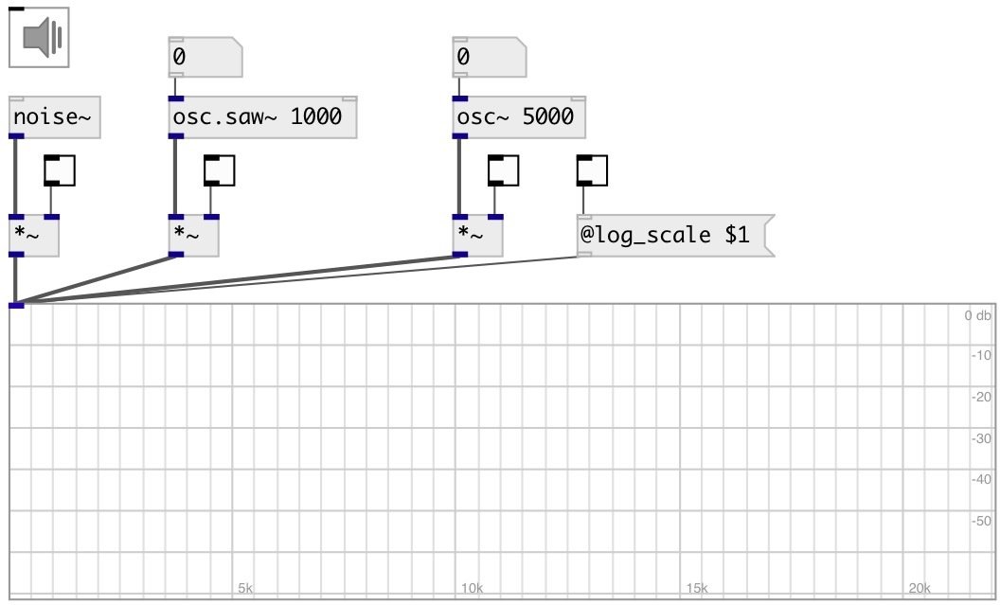

[index](index.html) :: [ui](category_ui.html)
---

# ui.spectroscope~
**aliases:** [ui.ssc\~]

###### Spectroscope GUI object

*available since version:* 0.1

---

## methods:

* **pos**
set UI element position 
  __parameters:__
  - **X** top left x-coord 
    type: float  
    required: True  

  - **Y** top right y-coord 
    type: float  
    required: True  

## properties:

* **@refresh** 
Get/set approximate refresh rate 
_type:_ int 
_units:_ ms 
_range:_ 20..1000 
_default:_ 100 

* **@log_scale** 
Get/set display in log scale 
_type:_ bool 
_default:_ 0 

* **@receive** 
Get/set receive source 
_type:_ symbol 
_default:_ (null) 

* **@size** 
Get/set element size (width, height pair) 
_type:_ list 
_default:_ 150 100 

* **@pinned** 
Get/set pin mode. if 1 - put element to the lowest level 
_type:_ bool 
_default:_ 0 

* **@active_color** 
Get/set active color (list of red, green, blue values in 0-1 range) 
_type:_ list 
_default:_ 0 0.75 1 1 

* **@label_color** 
Get/set label color (list of red, green, blue values in 0-1 range) 
_type:_ list 
_default:_ 0 0 0 1 

* **@background_color** 
Get/set element background color (list of red, green, blue values in 0-1 range) 
_type:_ list 
_default:_ 0.93 0.93 0.93 1 

* **@border_color** 
Get/set border color (list of red, green, blue values in 0-1 range) 
_type:_ list 
_default:_ 0.6 0.6 0.6 1 

* **@scale_color** 
Get/set scale color (list of red, green, blue values in 0-1 range) 
_type:_ list 
_default:_ 0.6 0.6 0.6 1 

* **@fontsize** 
Get/set fontsize 
_type:_ int 
_range:_ 4..100 
_default:_ 11 

* **@fontname** 
Get/set fontname 
_type:_ symbol 
_enum:_ Courier, DejaVu, Helvetica, Monaco, Times 
_default:_ Helvetica 

* **@fontweight** 
Get/set font weight 
_type:_ symbol 
_enum:_ normal, bold 
_default:_ normal 

* **@fontslant** 
Get/set font slant 
_type:_ symbol 
_enum:_ roman, italic 
_default:_ roman 

## inlets:

* signal input 
_type:_ audio

## keywords:

[ui](keywords/ui.html)
[spectroscope](keywords/spectroscope.html)

**See also:**
[\[ui.scope~\]](ui.scope~.html)

**Authors:** Alex Nadzharov, Serge Poltavsky

**License:** GPL3 or later

