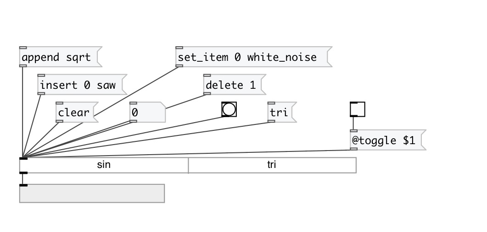
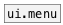

[< reference home](index.html)
---

# ui.tab

displays a list of text buttons or text toggles

---

 

---

---
arguments:

---
properties:

@items: number of
            tabs 
@toggle: toggle mode. In toggle moe
            multiple selection is possible 
@orientation: tab orientation. 1 is
            vertical, 0 is horizontal 
@selected: list of selected items (in
            toggle mode) 
@current: current selected index
            (in switch mode) 
@count: number of
            tabs 
@presetname: preset name for using with
            [ui.preset] 
@send: send destination 
@receive: receive source 
@size: element size (width, height
            pair) 
@pinned: pin mode. if 1 - put element
            to the lowest level 
@active_color: active color (list of
            red, green, blue values in 0-1 range) 
@text_color: text color (list of red,
            green, blue values in 0-1 range) 
@hover_color: hover color (list of
            red, green, blue values in 0-1 range) 
@background_color: element
            background color (list of red, green, blue values in 0-1 range) 
@border_color: border color (list
            of red, green, blue values in 0-1 range) 
@fontsize: 
            fontsize 
@fontname: fontname 
@fontweight: font
            weight 
@fontslant: font
            slant 

---
see also: 

