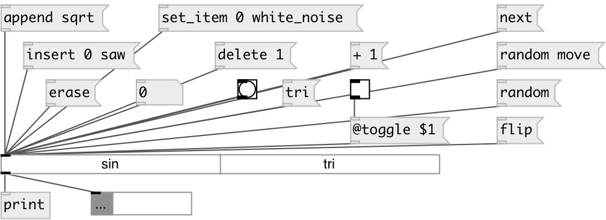

[index](index.html) :: [ui](category_ui.html)
---

# ui.tab

###### displays a list of text buttons or text toggles

*available since version:* 0.1

---

## methods:

* **+ STEP**
moves several steps forward on a loop (single mode only), output newly selected
item 

* **- STEP**
moves several step backwards on a loop (single mode only), output newly
selected item 

* **append**
appends new tab item 
  __parameters:__
  - **ATOMS** item name 
    type: list  
    required: True  

* **erase**
clears all tab menu 

* **clear**
clears specified preset 
  __parameters:__
  - **IDX** preset index 
    type: int  
    required: True  

* **delete**
removes item from tab 
  __parameters:__
  - **IDX** removed item index 
    type: int  
    required: True  

* **flip**
flips radio (only in checklist mode) 

* **insert**
inserts new tab item before specified position 
  __parameters:__
  - **IDX** item position 
    type: int  
    required: True  

  - **ATOM** item name 
    type: atom  
    required: True  

* **interp**
for this object acts as *load*, no preset interpolation performed 

* **load**
loads specified preset 
  __parameters:__
  - **IDX** preset index 
    type: int  
    required: True  

* **next**
moves to next item until last item is reached (single mode only). Output new
item 

* **pos**
set UI element position 
  __parameters:__
  - **X** top left x-coord 
    type: float  
    required: True  

  - **Y** top right y-coord 
    type: float  
    required: True  

* **prev**
moves to previous item until first item is reached (single mode only). Output
new item 

* **random**
select random item. If called [random move( moves to random item (excluding the
current one) 

* **select**
selects specified item in tab 
  __parameters:__
  - **IDX** item index 
    type: int  
    required: True  

* **set**
silently sets tab state. 
  __parameters:__
  - **IDX** item index 
    type: int  
    required: True  

* **set_item**
renames tab item 
  __parameters:__
  - **IDX** item index 
    type: int  
    required: True  

  - **ATOMS** item name 
    type: list  
    required: True  

* **store**
stores specified preset 
  __parameters:__
  - **IDX** preset index 
    type: int  
    required: True  

## properties:

* **@items** 
Get/set list of tab names 
_type:_ list 

* **@toggle** 
Get/set toggle mode. In toggle moe multiple selection is possible 
_type:_ bool 
_default:_ 0 

* **@orientation** 
Get/set tab orientation. 1 is vertical, 0 is horizontal 
_type:_ bool 
_default:_ 0 

* **@selected** (readonly)
Get list of selected items (in toggle mode) 
_type:_ list 

* **@current** (readonly)
Get current selected index (in switch mode) 
_type:_ int 
_default:_ 0 

* **@count** (readonly)
Get number of tabs 
_type:_ int 
_default:_ 0 

* **@presetname** 
Get/set preset name for using with [ui.preset] 
_type:_ symbol 
_default:_ (null) 

* **@send** 
Get/set send destination 
_type:_ symbol 
_default:_ (null) 

* **@receive** 
Get/set receive source 
_type:_ symbol 
_default:_ (null) 

* **@size** 
Get/set element size (width, height pair) 
_type:_ list 
_default:_ 100 15 

* **@pinned** 
Get/set pin mode. if 1 - put element to the lowest level 
_type:_ bool 
_default:_ 0 

* **@active_color** 
Get/set active color (list of red, green, blue values in 0-1 range) 
_type:_ list 
_default:_ 0 0.75 1 1 

* **@text_color** 
Get/set text color (list of red, green, blue values in 0-1 range) 
_type:_ list 
_default:_ 0 0 0 1 

* **@hover_color** 
Get/set hover color (list of red, green, blue values in 0-1 range) 
_type:_ list 
_default:_ 0.5 0.5 0.5 1 

* **@background_color** 
Get/set element background color (list of red, green, blue values in 0-1 range) 
_type:_ list 
_default:_ 0.93 0.93 0.93 1 

* **@border_color** 
Get/set border color (list of red, green, blue values in 0-1 range) 
_type:_ list 
_default:_ 0.6 0.6 0.6 1 

* **@fontsize** 
Get/set fontsize 
_type:_ int 
_range:_ 4..100 
_default:_ 11 

* **@fontname** 
Get/set fontname 
_type:_ symbol 
_enum:_ Courier, DejaVu, Helvetica, Monaco, Times 
_default:_ Helvetica 

* **@fontweight** 
Get/set font weight 
_type:_ symbol 
_enum:_ normal, bold 
_default:_ normal 

* **@fontslant** 
Get/set font slant 
_type:_ symbol 
_enum:_ roman, italic 
_default:_ roman 

## inlets:

* in single mode outputs tab state as list: INDEX TAB_NAME. In toggle mode outputs current state like: @selected 0 1 0 1 0 etc. and list of two values: [CHANGED_IDX CHANGED_VALUE] 
_type:_ control

## outlets:

* output 
_type:_ control

## keywords:

[ui](keywords/ui.html)
[tab](keywords/tab.html)

**See also:**
[\[ui.menu\]](ui.menu.html)

**Authors:** Pierre Guillot, Serge Poltavsky

**License:** GPL3 or later

