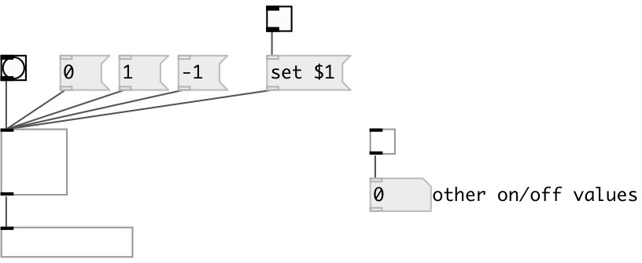

[index](index.html) :: [ui](category_ui.html)
---

# ui.toggle

###### modern toggle widget

*available since version:* 0.1

---

## information
This is the ceammc counterpart of the vanilla toggle

## methods:

* **dump**
dumps all object info to Pd console window 

* **set**
sets toggle state without output 

* **load**
loads specified preset 
  __parameters:__
  - **IDX** preset index 
    type: int  
    required: True  

* **store**
stores specified preset 
  __parameters:__
  - **IDX** preset index 
    type: int  
    required: True  

* **clear**
clears specified preset 
  __parameters:__
  - **IDX** preset index 
    type: int  
    required: True  

* **interp**
for this object acts as *load*, no interpolation performed 

* **pos**
set UI element position 
  __parameters:__
  - **X** top left x-coord 
    type: float  
    required: True  

  - **Y** top right y-coord 
    type: float  
    required: True  

## properties:

* **@value** 
Get/set widget logical value 
__type:__ float 
__enum:__ 0, 1 
__default:__ 0 

* **@on_value** 
Get/set output on value 
__type:__ float 
__default:__ 1 

* **@off_value** 
Get/set output off value 
__type:__ float 
__default:__ 0 

* **@midi_channel** 
Get/set binded MIDI channel. 0 means listen to all channels 
__type:__ int 
__range:__ 0..16 
__default:__ 0 

* **@midi_control** 
Get/set binded MIDI controller number. 0 means not binded to any controller. 
__type:__ int 
__range:__ 0..128 
__default:__ 0 

* **@presetname** 
Get/set preset name for using with [ui.preset] 
__type:__ symbol 
__default:__ (null) 

* **@send** 
Get/set send destination 
__type:__ symbol 
__default:__ (null) 

* **@receive** 
Get/set receive source 
__type:__ symbol 
__default:__ (null) 

* **@size** 
Get/set element size (width, height pair) 
__type:__ list 
__default:__ 15 15 

* **@pinned** 
Get/set pin mode. if 1 - put element to the lowest level 
__type:__ int 
__enum:__ 0, 1 
__default:__ 0 

* **@active_color** 
Get/set active color (list of red, green, blue values in 0-1 range) 
__type:__ list 
__default:__ 0 0.75 1 1 

* **@background_color** 
Get/set element background color (list of red, green, blue values in 0-1 range) 
__type:__ list 
__default:__ 0.93 0.93 0.93 1 

* **@border_color** 
Get/set border color (list of red, green, blue values in 0-1 range) 
__type:__ list 
__default:__ 0.6 0.6 0.6 1 

* **@fontsize** 
Get/set fontsize 
__type:__ int 
__range:__ 4..11 
__default:__ 11 

* **@fontname** 
Get/set fontname 
__type:__ symbol 
__default:__ Helvetica 

* **@fontweight** 
Get/set font weight 
__type:__ symbol 
__enum:__ normal, bold 
__default:__ normal 

* **@fontslant** 
Get/set font slant 
__type:__ symbol 
__enum:__ roman, italic 
__default:__ roman 

## inlets:

* change toggle state 
__type:__ control 

## outlets:

* outputs @on_value or @off_value (by default 0 or 1)
__type:__ control 

## keywords:

[ui](keywords/ui.html)
[toggle](keywords/toggle.html)

**See also:**
[\[ui.bang\]](ui.bang.html)

**Authors:** Pierre Guillot, Serge Poltavsky

**License:** GPL3 or later

