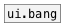

[<<< reference home](ceammc_lib.md)
---

# ui.toggle

```


                  [T]
                  |
[B] [0( [1( [-1(  [set $1(
|   |   |   |     |
|   |   |   |     |
[ui.toggle @size=40x40]
|
|
[m set]
|
[ (

            
```
---
modern toggle widget
---
arguments:


---
properties:

@value: widget value<br>
@presetname: preset name for using with
            [ui.preset]<br>
@send: send destination<br>
@receive: receive source<br>
@size: element size (width, height
            pair)<br>
@pinned: pin mode. if 1 - put element
            to the lowest level<br>
@active_color: active color (list of
            red, green, blue values in 0-1 range)<br>
@background_color: element
            background color (list of red, green, blue values in 0-1 range)<br>
@border_color: border color (list
            of red, green, blue values in 0-1 range)<br>
@fontsize: 
            fontsize<br>
@fontname: fontname<br>
@fontweight: font
            weight<br>
@fontslant: font
            slant<br>

---
see also:<br>
[](ui.bang.md)
