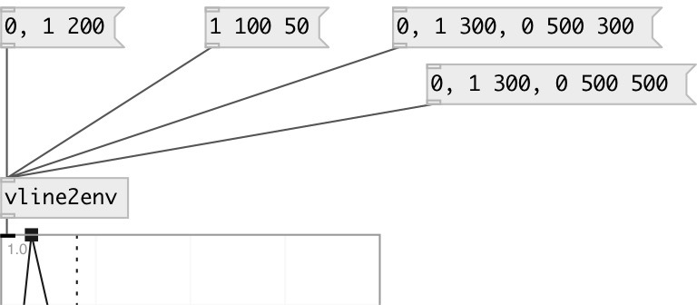

[index](index.html) :: [env](category_env.html)
---

# vline2env

###### Converts vline messages to env

*available since version:* 0.6

---

## inlets:

* output current envelope 
__type:__ control 

## outlets:

* envelope output
__type:__ control 

## keywords:

[envelope](keywords/envelope.html)
[vline](keywords/vline.html)

**See also:**
[\[env-&gt;vline\]](env-%3Evline.html)
[\[env-&gt;array\]](env-%3Earray.html)

**Authors:** Serge Poltavsky

**License:** GPL3 or later

