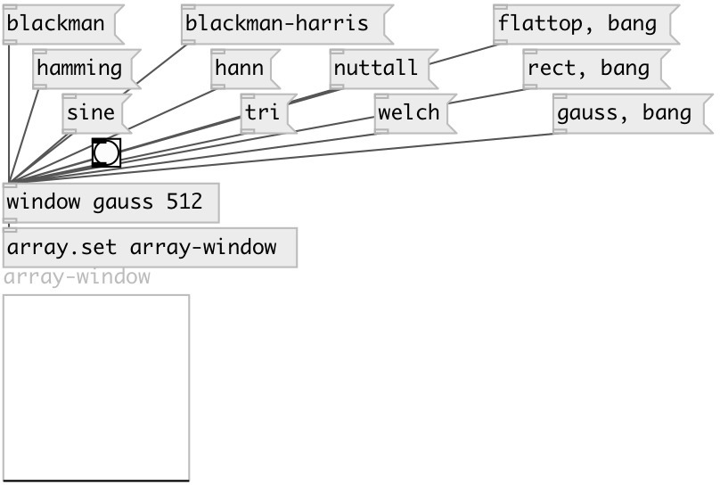

[index](index.html) :: [base](category_base.html)
---

# window
**aliases:** [ceammc/window], [ceammc/win], [win]

###### returns window value by given window position

*available since version:* 0.4

---

## arguments:

* **NAME**
window name: blackman, blackman-harris, flattop, gauss, hamming, hann, nuttall,
rect, sine, tri, welch 
_type:_ symbol 

* **SIZE**
window size 
_type:_ int 

## methods:

* **blackman**
Sets Blackman window type 

* **blackman-harris**
Sets Blackman-Harris window type 

* **flattop**
Sets Flattop window type 

* **gauss**
Sets Gauss window type 

* **hamming**
Sets Hamming window type 

* **hann**
Sets Hann window type 

* **nuttall**
Sets Nuttall window type 

* **rect**
Sets Rectangle window type 

* **sine**
Sets Sine window type 

* **tri**
Sets Triangle window type 

* **welch**
Sets Welch window type 

## properties:

* **@type** 
Get/set window type. See argument description 
_type:_ symbol 
_default:_ hann 

* **@size** 
Get/set window size 
_type:_ int 
_units:_ samp 
_min value:_ 16 
_default:_ 512 

## inlets:

* output all window values as list 
_type:_ control

## outlets:

* sample number 
_type:_ control

## keywords:

[window](keywords/window.html)

**Authors:** Serge Poltavsky

**License:** GPL3 or later

