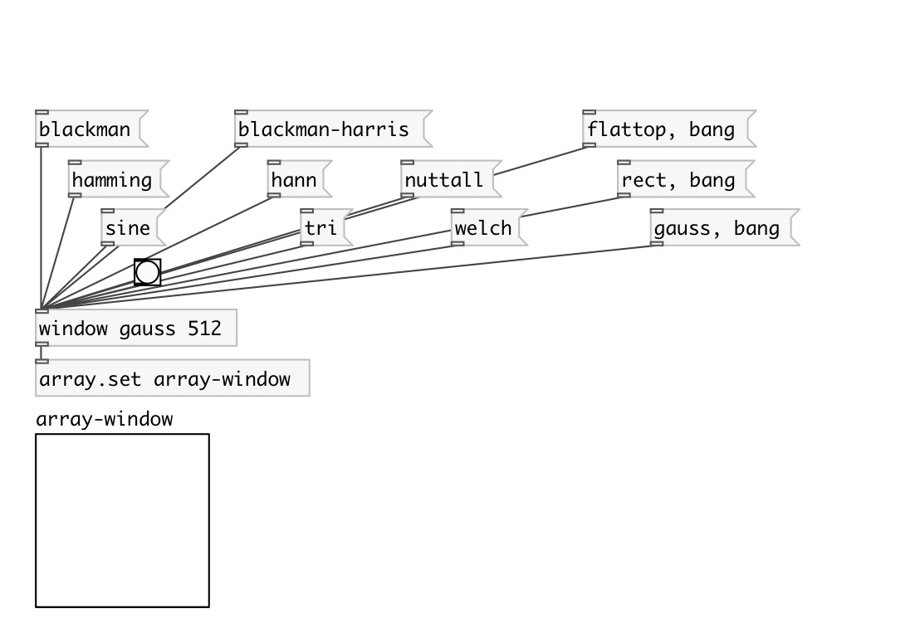

[< reference home](index.html)
---

# window

returns window value by given window position

---

 

---

---
arguments:

NAME: window name: blackman, blackman-harris, flattop,
            gauss, hamming, hann, nuttall, rect, sine, tri, welch 
SIZE: window size 

---
properties:

@type: window type. See argument
            description 
@size(samp): window
            size 

