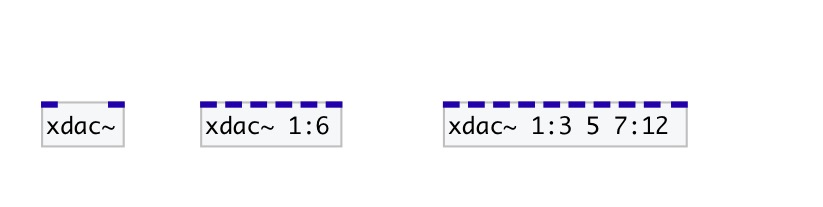

[< reference home](index.html)
---

# xdac~

dac~ with channel ranges

---

 

---

---
arguments:

OUTS: list of output channels: single channel number or X:Y
            range, that means from X channel to Y (including last one). If not specified - using 1
            and 2 out channels 

---
properties:

