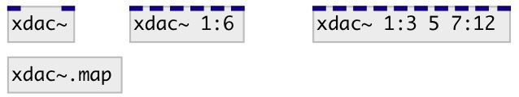

[index](index.html) :: [base](category_base.html)
---

# xdac~

###### dac~ with channel ranges

*available since version:* 0.8

---

## arguments:

* **OUTS**
list of output channels: single channel number or X:Y range, that means from X
channel to Y (including last one). If not specified - using 1 and 2 out
channels 
__type:__ list 

## inlets:

* first specified channel 
__type:__ audio 
* ... specified channel 
__type:__ audio 
* n-th specified channel 
__type:__ audio 

## keywords:

[base](keywords/base.html)

**Authors:** Serge Poltavsky

**License:** GPL3 or later

